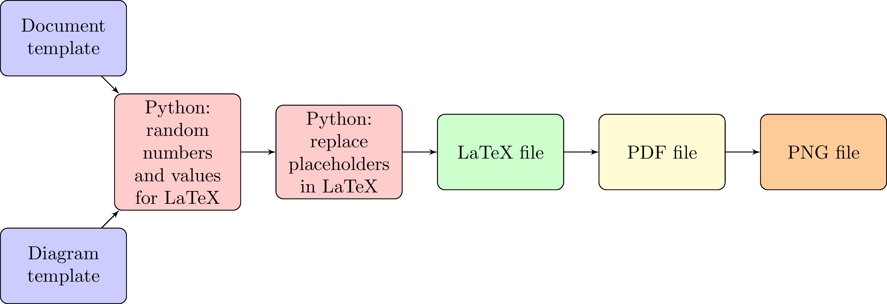

====================================================
LaTeX introduction
====================================================

LaTeX
-----------------

| LaTeX, is a document preparation system for high-quality typesetting. 
| It is most often used for technical or scientific documents but it can be used for almost any form of publishing.
| LaTeX is pronounced «Lah-tech» or «Lay-tech» (as the 'ch' sound in Scottish words like loch), 
| The main LaTeX files have a .tex file extension.

| The examples use python for random number generation and the building of the LaTeX code from templates.

----

Documentation
------------------

See: https://www.LaTeX-project.org/help/documentation/

----

Youtube Tutorials 
-----------------------------

Some useful tutorial series are listed:

| See: https://www.youtube.com/watch?v=GVbH7smEM24&list=PLSE7WKf_qqo2CE5P9-KQkqcs4FryswG3j
| See: https://www.youtube.com/watch?v=0ivLZh9xK1Q&list=PL1D4EAB31D3EBC449&index=1
| See: https://www.youtube.com/watch?v=A21_BXfOLJI&list=PLLPWJ64IYnCp4SVF9aGVQvCVob9N_B9SR
| See: https://www.youtube.com/watch?v=H2fq_rUXD1w&list=PLBvKkY7PJCfwUrVyf4TRcQM0E9a2B8RjT&index=22

