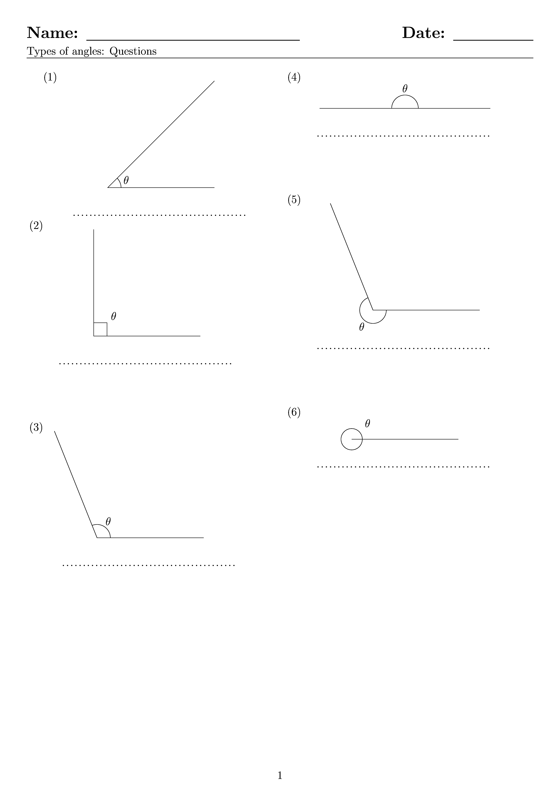
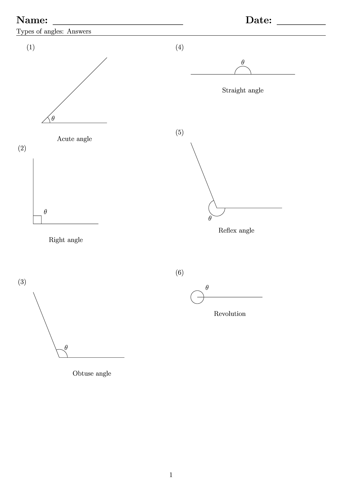

====================================================
Angle types
====================================================

| Diagrams of angle types are below.
| These are LaTeX generated only with separate question and answer sheet pdfs.

----

Sample Question page
---------------------

| A sample question page file is shown below.

----

Sample Answer page
--------------------

| A sample answer page file is shown below.

----

Sample Tex and pdf files
-----------------------------

| Angle types question sheet:
| :download:`angle_types_q.tex<files/angle_types_q.tex>`
| :download:`angle_types_q.pdf<files/angle_types_q.pdf>`

| Angle types answer sheet:
| :download:`angle_types_ans.tex<files/angle_types_ans.tex>`
| :download:`angle_types_ans.pdf<files/angle_types_ans.pdf>`

-----

Angle types in random order
-------------------------------

| The python file to make a worksheet with the angle types is random order is below.
| :download:`angles_types_maker.py<makers/angles_types_maker.py>`

| The required LaTeX files are below.
| :download:`angle_types_q_template.tex<makers/angle_types_q_template.tex>`
| :download:`angle_types_ans_template.tex<makers/angle_types_ans_template.tex>`

| The python file, **angles_types_maker.py**, when run, will ask for these inputs:
| Choose the file name base: ``""Enter the filename suffix to be added to the prefix angle_types_: "``. The filename will have "_q" added for the question booklet and "_ans" for the answer booklet.

----

Sample Angle types in random order: Tex and pdf files
-------------------------------------------------------

| Angle types question sheet:
| :download:`angle_types_1_q.tex<files/angle_types_1_q.tex>`
| :download:`angle_types_1_q.pdf<files/angle_types_1_q.pdf>`

| Angle types answer sheet:
| :download:`angle_types_1_ans.tex<files/angle_types_1_ans.tex>`
| :download:`angle_types_1_ans.pdf<files/angle_types_1_ans.pdf>`

