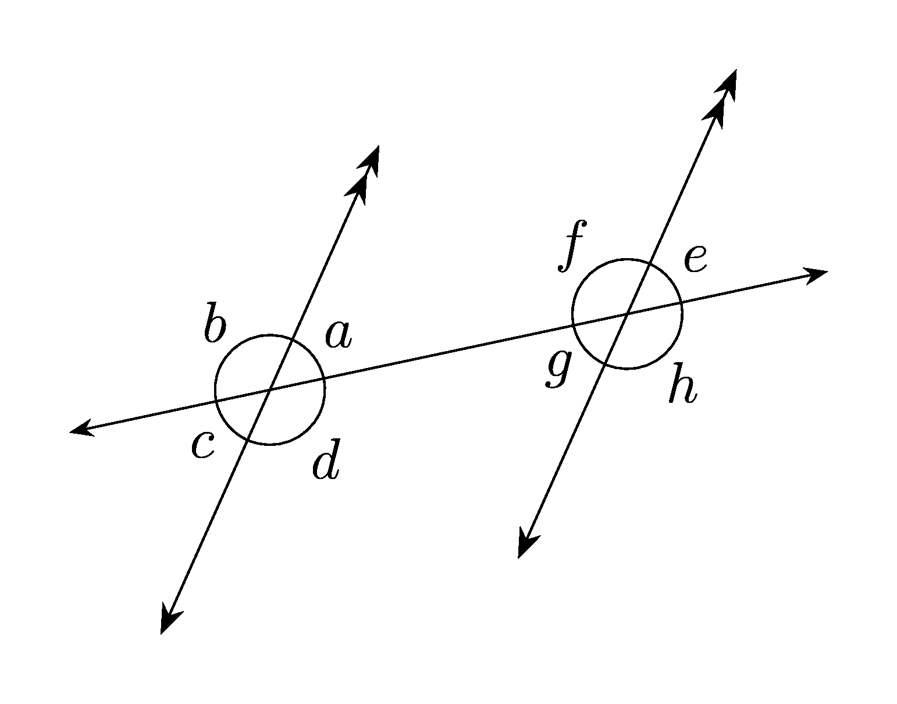

====================================================
Angles and Parallel lines
====================================================

| The diagrams below show 2 parallel lines with a traversal and 2 angles.
| These are python generated via LaTeX with separate question and answer sheet pdfs.

----

Angle names
------------------------------------------

| The base diagram for the coding is shown below. It has the names of angles and their placement.

| Diagram files:
| :download:`parallel_lines_angles.tex<files/parallel_lines_angles.tex>`
| :download:`parallel_lines_angles.pdf<files/parallel_lines_angles.pdf>`

----

Sample Question and answer diagrams
------------------------------------------

.. grid:: 2
    :gutter: 0
    :margin: 0
    :padding: 0

    .. grid-item-card::  

        pla_corresponding1_q
        ^^^
        :download:`png<files/pla_corresponding1_q.png>`
        :download:`pdf<files/pla_corresponding1_q.pdf>`
        :download:`tex<files/pla_corresponding1_q.tex>`

        .. figure:: files/pla_corresponding1_q.png
            :width: 600
            :alt: pla_corresponding1_q
            :figclass: align-center

    .. grid-item-card::

        pla_corresponding1_ans
        ^^^
        :download:`png<files/pla_corresponding1_ans.png>`
        :download:`pdf<files/pla_corresponding1_ans.pdf>`
        :download:`tex<files/pla_corresponding1_ans.tex>`

        .. figure:: files/pla_corresponding1_ans.png
            :width: 600
            :alt: pla_corresponding1_ans
            :figclass: align-center

.. grid:: 2
    :gutter: 0
    :margin: 0
    :padding: 0

    .. grid-item-card::  

        pla_alternate1_q
        ^^^
        :download:`png<files/pla_alternate1_q.png>`
        :download:`pdf<files/pla_alternate1_q.pdf>`
        :download:`tex<files/pla_alternate1_q.tex>`

        .. figure:: files/pla_alternate1_q.png
            :width: 600
            :alt: pla_alternate1_q
            :figclass: align-center

    .. grid-item-card::

        pla_alternate1_ans
        ^^^
        :download:`png<files/pla_alternate1_ans.png>`
        :download:`pdf<files/pla_alternate1_ans.pdf>`
        :download:`tex<files/pla_alternate1_ans.tex>`

        .. figure:: files/pla_alternate1_ans.png
            :width: 600
            :alt: pla_alternate1_ans
            :figclass: align-center

.. grid:: 2
    :gutter: 0
    :margin: 0
    :padding: 0

    .. grid-item-card::  

        pla_cointerior1_q
        ^^^
        :download:`png<files/pla_cointerior1_q.png>`
        :download:`pdf<files/pla_cointerior1_q.pdf>`
        :download:`tex<files/pla_cointerior1_q.tex>`

        .. figure:: files/pla_cointerior1_q.png
            :width: 600
            :alt: pla_cointerior1_q
            :figclass: align-center

    .. grid-item-card::

        pla_cointerior1_ans
        ^^^
        :download:`png<files/pla_cointerior1_ans.png>`
        :download:`pdf<files/pla_cointerior1_ans.pdf>`
        :download:`tex<files/pla_cointerior1_ans.tex>`

        .. figure:: files/pla_cointerior1_ans.png
            :width: 600
            :alt: pla_cointerior1_ans
            :figclass: align-center

.. grid:: 2
    :gutter: 0
    :margin: 0
    :padding: 0

    .. grid-item-card::  

        pla_external1_q
        ^^^
        :download:`png<files/pla_external1_q.png>`
        :download:`pdf<files/pla_external1_q.pdf>`
        :download:`tex<files/pla_external1_q.tex>`

        .. figure:: files/pla_external1_q.png
            :width: 600
            :alt: pla_external1_q
            :figclass: align-center

    .. grid-item-card::

        pla_external1_ans
        ^^^
        :download:`png<files/pla_external1_ans.png>`
        :download:`pdf<files/pla_external1_ans.pdf>`
        :download:`tex<files/pla_external1_ans.tex>`

        .. figure:: files/pla_external1_ans.png
            :width: 600
            :alt: pla_external1_ans
            :figclass: align-center

-----

Booklets using python
-----------------------------

| The booklet files below are generated using python and LaTeX templates.

Required files:

| :download:`parallel_lines_angles_booklet_ans_template<makers/parallel_lines_angles_booklet_ans_template.tex>`
| :download:`parallel_lines_angles_booklet_template<makers/parallel_lines_angles_booklet_template.tex>`
| :download:`parallel_lines_angles_booklet_diagram_template<makers/parallel_lines_angles_booklet_diagram_template.tex>`

| :download:`parallel_lines_angles_functions<makers/parallel_lines_angles_functions.py>`
| :download:`parallel_lines_angles_booklet_diagram_maker<makers/parallel_lines_angles_booklet_diagram_maker.py>`

----

Sample booklet Tex and pdf files
-------------------------------------

| Question sheet:
| :download:`pla_Bk_corresponding4_q.tex<booklets/pla_Bk_corresponding4_q.tex>`
| :download:`pla_Bk_corresponding4_q.pdf<booklets/pla_Bk_corresponding4_q.pdf>`

| Answer sheet:
| :download:`pla_Bk_corresponding4_ans.tex<booklets/pla_Bk_corresponding4_ans.tex>`
| :download:`pla_Bk_corresponding4_ans.pdf<booklets/pla_Bk_corresponding4_ans.pdf>`

| Question sheet:
| :download:`pla_Bk_alternate4_q.tex<booklets/pla_Bk_alternate4_q.tex>`
| :download:`pla_Bk_alternate4_q.pdf<booklets/pla_Bk_alternate4_q.pdf>`

| Answer sheet:
| :download:`pla_Bk_alternate4_ans.tex<booklets/pla_Bk_alternate4_ans.tex>`
| :download:`pla_Bk_alternate4_ans.pdf<booklets/pla_Bk_alternate4_ans.pdf>`

| Question sheet:
| :download:`pla_Bk_cointerior4_q.tex<booklets/pla_Bk_cointerior4_q.tex>`
| :download:`pla_Bk_cointerior4_q.pdf<booklets/pla_Bk_cointerior4_q.pdf>`

| Answer sheet:
| :download:`pla_Bk_cointerior4_ans.tex<booklets/pla_Bk_cointerior4_ans.tex>`
| :download:`pla_Bk_cointerior4_ans.pdf<booklets/pla_Bk_cointerior4_ans.pdf>`

| Question sheet:
| :download:`pla_Bk_external4_q.tex<booklets/pla_Bk_external4_q.tex>`
| :download:`pla_Bk_external4_q.pdf<booklets/pla_Bk_external4_q.pdf>`

| Answer sheet:
| :download:`pla_Bk_external4_ans.tex<booklets/pla_Bk_external4_ans.tex>`
| :download:`pla_Bk_external4_ans.pdf<booklets/pla_Bk_external4_ans.pdf>`

| Question sheet:
| :download:`pla_Bk_random20_q.tex<booklets/pla_Bk_random20_q.tex>`
| :download:`pla_Bk_random20_q.pdf<booklets/pla_Bk_random20_q.pdf>`

| Answer sheet:
| :download:`pla_Bk_random20_ans.tex<booklets/pla_Bk_random20_ans.tex>`
| :download:`pla_Bk_random20_ans.pdf<booklets/pla_Bk_random20_ans.pdf>`
