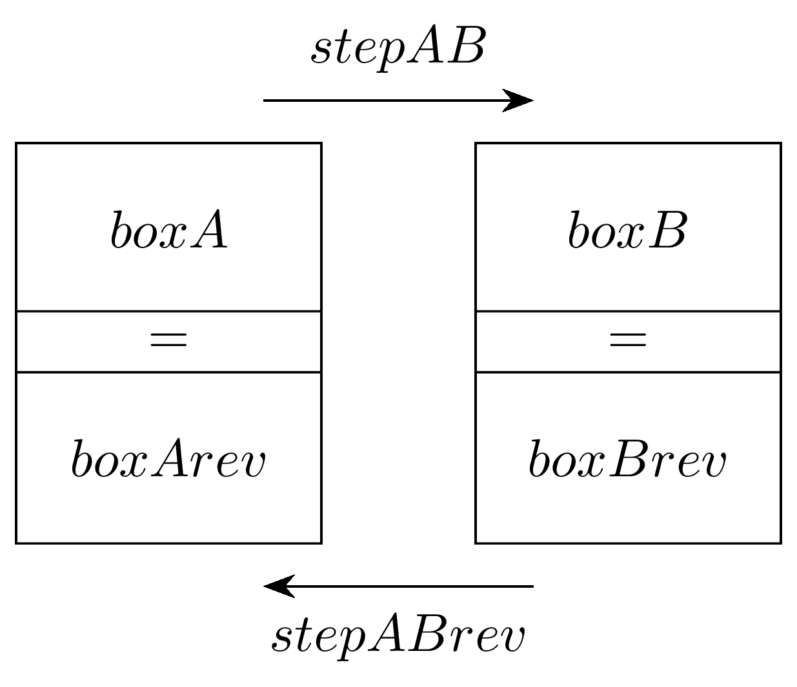

====================================================
Backtracking 1-step diagram - manual
====================================================

| The LaTeX in this section is for a 1-step backtracking diagram.
| The values in the diagram can be entered manually into the LaTeX code.
| The snippet below from the LaTeX file shows a block in the preamble of the .tex file where the values for the backtacking diagram can be manually edited.

| The values, ``x, 2x, 6, 3`` in the braces {} can be altered.
| The processes, ``\times2`` and ``\div2`` can be replaced with ``+`` and ``-``.

.. code-block:: LaTeX

    % modify values for backtracking
    \def\stepAB{\times2} 
    \def\stepABrev{\div2}

    \def\boxA{x}
    \def\boxB{2x}
    \def\boxBrev{6}
    \def\boxArev{3}
    % end modify values for backtracking

----

A 1-step backtracking diagram with answers
--------------------------------------------

.. grid:: 2
   :gutter: 0
   :margin: 0
   :padding: 0

   .. grid-item-card::  

      question
      ^^^
      :download:`png<manual/backtrack_1step_mq.png>`
      :download:`pdf<manual/backtrack_1step_mq.pdf>`
      :download:`tex<manual/backtrack_1step_mq.tex>`

      .. figure:: manual/backtrack_1step_mq.png
         :width: 300
         :alt: backtrack_1step_mq
         :figclass: align-center

   .. grid-item-card::  
      
      answer
      ^^^
      :download:`png<manual/backtrack_1step_mans.png>`
      :download:`pdf<manual/backtrack_1step_mans.pdf>`
      :download:`tex<manual/backtrack_1step_mans.tex>`

      .. figure:: manual/backtrack_1step_mans.png
         :width: 300
         :alt: backtrack_1step_mans
         :figclass: align-center

----

1-step backtracking LaTeX
---------------------------

A LaTeX .tex file consists of two parts, the preamble and the main document. 

----

LaTeX preamble
----------------------

| In the preamble, set the document class, and import required packages and set their options.
| Macro definitions, such as those for the variables to hold the diagram values, are also in the preamble.

.. code-block:: LaTeX

    \documentclass[border = 1mm]{standalone}
    \usepackage{tikz}
    \usetikzlibrary{positioning}
    \usetikzlibrary {arrows.meta}

    \tikzset{backtrack/.style={rectangle,draw=black,fill=white,
    inner sep=2pt,minimum height=32pt, minimum width=20mm}}
    \tikzset{backtrackeq/.style={rectangle,draw=black,fill=white,
    inner sep=2pt,minimum height=12pt, minimum width=20mm}}
    \tikzset{backtrackstep/.style={rectangle,draw=none,fill=white,
    inner sep=2pt,minimum height=12pt, minimum width=20mm}}

    % modify values for backtracking
    \def\stepAB{\times2} 
    \def\stepABrev{\div2}

    \def\boxA{x}
    \def\boxB{2x}
    \def\boxBrev{6}
    \def\boxArev{3}
    % end modify values for backtracking

Document class
~~~~~~~~~~~~~~~~~~~

| The code ``\documentclass[border = 1mm]{standalone}`` is used to define a document that can be used to create graphics that are self-contained and can be easily included in other documents. 
| The argument `[border = 1mm]` specifies the size of the border around the content of the document.
| See: https://mirror.cse.unsw.edu.au/pub/CTAN/macros/LaTeX/contrib/standalone/standalone.pdf

tikz package
~~~~~~~~~~~~~~~~~~~

| The code ``\usepackage{tikz}`` imports the TikZ package which allows you to create diagrams and graphics programmatically, such as points, lines and paths, circles, ellipses and rectangles.
| The code ``\usetikzlibrary{positioning}`` is used to import the positioning library which provides advanced positioning options for nodes (points in a diagram that can be referenced and used to draw lines or shapes).
| For docs on the tikz package see: https://tikz.dev/

tikzset for styles
~~~~~~~~~~~~~~~~~~~

| Styles are set so that applying the same style to multiple parts of the diagram is more efficient.
| This line ``\tikzset{backtrack...}}`` defines a new style called ``backtrack`` for rectangles in TikZ. 
| The style is defined with the following properties:

    * `rectangle`: The shape of the node is a rectangle.
    * `draw=black`: The border color of the rectangle is black.
    * `fill=white`: The fill color of the rectangle is white.
    * `inner sep=2pt`: The distance between the border and the content of the node is 2pt.
    * `minimum height=32pt`: The minimum height of the rectangle is 32pt.
    * `minimum width=20mm`: The minimum width of the rectangle is 20mm.

|  ``\tikzset{backtrack...}`` defines the top and bottom rectangle features.
|  ``\tikzset{backtrackeq...}`` defines the middle rectangle features.
|  ``\tikzset{backtrackstep...}`` defines the step features of the text on an arrow.

Macro definitions
~~~~~~~~~~~~~~~~~~

| The variables to be used are shown below in the Macro definitions.
| These will be used in creating the backtracking diagram.
| This allows a user to replace the values that show on the backtracking diagram, here, in one place, instead of in the LaTeX code for the diagram itself.

.. code-block:: LaTeX

    % modify values for backtracking
    \def\stepAB{\times2} 
    \def\stepABrev{\div2}

    \def\boxA{x}
    \def\boxB{2x}
    \def\boxBrev{6}
    \def\boxArev{3}
    % end modify values for backtracking

Macro definitions and Variables
~~~~~~~~~~~~~~~~~~~~~~~~~~~~~~~~~~

| The command ``\def`` is used to define new commands in LaTeX. 
| The syntax for defining a new command is ``\def\commandname{replacement text}``.
| When the command is used in the document, LaTeX replaces it with the replacement text.

| The command ``\def\stepAB{\times2}`` defines a new command named, ``\stepAB``, that takes no arguments and expands to the text ``\times2``. i.e. sets the value of the variable, ``stepAB``, to ``{\times2}``. 
| Later in the code, ``{$\stepAB$}`` allows the variable value, ``\times2`` to be placed in the diagram. It appears as "x2".

| The 1-step backtracking diagram shows the names of the variables used for each part of the diagram.

----------------------------------------
The document environment
----------------------------------------

| The tikzpicture part of the document environment is below.
| It contains nodes with names to identify each position used to draw lines and rectangles. 

.. code-block:: LaTeX

    \begin{document}

    \begin{tikzpicture}
        \node[backtrack] (boxA) at (0, 0) {$\boxA$};
        \node[backtrack] (boxB) [right=1cm of boxA] {$\boxB$};
        
        \node[backtrackeq] (boxAeq) [below=-1pt of boxA] {$=$};
        \node[backtrackeq] (boxBeq) [below=-1pt of boxB] {$=$};
        
        \node[backtrack] (boxArev) [below=-1pt of boxAeq] {$\boxArev$};
        \node[backtrack] (boxBrev) [below=-1pt of boxBeq] {$\boxBrev$};
            
        \node (boxAr) at ([yshift=24pt,xshift=5mm]boxA) { };
        \node (boxBl) at ([yshift=24pt,xshift=-5mm]boxB) { };
        \draw [line width=0.4pt,-{Stealth[length=2mm]}] (boxAr)  --node[backtrackstep,above=2pt] {$\stepAB$} (boxBl);
        
        \node (boxBrevl) at ([yshift=-24pt,xshift=-5mm]boxBrev) { };
        \node (boxArevr) at ([yshift=-24pt,xshift=5mm]boxArev) { };
        \draw [line width=0.4pt,-{Stealth[length=2mm]}] (boxBrevl)  --node[backtrackstep,below=2pt] {$\stepABrev$} (boxArevr);
        
    \end{tikzpicture}

    \end{document}

Document
~~~~~~~~~~~~~~~~

| The command ``\begin{document}`` starts the body of the document. It is used to indicate the beginning of the text that will be typeset to appear in the output pdf. 
| The ``\end{document}`` command marks the end of the document

tikzpicture
~~~~~~~~~~~~~~~~~~~~~~~~

| ``\begin{tikzpicture}`` is a command in LaTeX that creates a new picture environment.

Nodes
~~~~~~~~~~~~~~~~~~~~~~~~

| A node is a point in a diagram that can be referenced and used to draw lines or shapes. 
| Nodes are created using the syntax \``node[<options>] (<name>) at (<coordinate>) {<text>}``. 
| The ``<options>`` are optional and can be used to customize the node's appearance. 
| The ``<name>`` is also optional and can be used to reference the node later. 
| The ``<coordinate>`` specifies the position of the node in the diagram. 
| The ``<text>`` is the text that appears inside the node.

| See syntax for nodes at: https://tikz.dev/tikz-shapes

| The command ``\node[backtrack] (boxA) at (0, 0) {$\boxA$}`` creates a node, named ``boxA``, with the style ``backtrack`` at position ``(0, 0)`` and with the content given by the variable ``\boxA``.

| The command ``\node[backtrack] (boxB) [right=1cm of boxA] {$\boxB$}`` creates a node with the style ``backtrack``, positioned 1cm to the right of another node 1cm to the right of node named ``boxA``and with text inside the node given by the variable ``\boxB``.

| The command ``\node[backtrackeq] (boxAeq) [below=-1pt of boxA] {$=$}``creates a node with the style ``backtrackeq``, placed 1pt below the node ``boxA`` with the text "=" inside the node .

| The command ``\node (boxAr) at ([yshift=24pt,xshift=5mm]boxA) { }`` creates a node named ``boxAr`` at a position that is 24pt above and 5mm to the right of the node named ``boxA``. The node is empty, so it doesn't contain any text.

| The command ``\draw [line width=0.4pt,-{Stealth[length=2mm]}]] (boxAr)  --node[backtrackstep,above=1pt] {$\stepAB$} (boxBl)`` is used to draw an arrow from the node ``boxAr`` to the node ``boxBl``. 
| The draw option ``[line width=0.4pt,-{Stealth[length=2mm]}]]`` draws a stealth arrow using the "Stealth" arrowhead. The arrow has a width of 0.4 point (which is very narrow) and a length of 2 mm. The arrowhead is a stealth shape, which has a pointed tip with a long shaft and a small head. It's commonly used in technical drawings.
| For more on arrows see: https://tikz.dev/tikz-arrows.

| The text value of the variable ``\stepAB`` is placed above the arrow.

Font size
~~~~~~~~~~~~~

| The default font size for most of the standard document classes in LaTeX is 10pt. 
| The font size options for most documentclasses are 10pt, 11pt, and 12pt.
| This size becomes the setting for ``\normalsize`` option, and all the other size commands are adjusted accordingly. 
| If you want to change the font size locally, you can use predefined commands such as ``\Large``, ``\Large``, ``\LARGE``, ``\Large``, ``\large``, ``\normalsize``, ``\small``, ``\footnotesize``, ``\scriptsize``, and ``\tiny``. 

----

1-step backtracking LaTeX
---------------------------

| The 1-step backtracking LaTeX for the question (incomplete) diagram is below.
| Some variable values have been commented out and replaced with empty values.

.. literalinclude:: manual/backtrack_1step_mq.tex
   :linenos:

| The 1-step backtracking LaTeX for the answer (complete) diagram is below.

.. literalinclude:: manual/backtrack_1step_mans.tex
   :linenos:
   
----

Line thickness notes
------------------------

| LIne thickness styles in Tikz are:

- ultra thin 0.1pt
- very thin 0.2pt
- thin 0.4pt %thin is the default
- semithick 0.6pt
- thick 0.8pt
- very thick 1.2pt
- ultra thick 1.6pt

