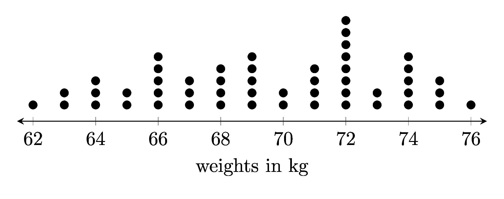

====================================================
Dot plots
====================================================

| To build dot plots diagrams, python uses a .txt file and a .tex template.

| The python file to make dot plots is below.
| :download:`dot_plot_maker.py<files/dot_plot_maker.py>`

| The required LaTeX files are below.
| :download:`dot_plot_template.tex<files/dot_plot_template.tex>`

| The custom python modules required are:
| :download:`magick_pdf_to_png.py<files/magick_pdf_to_png.py>`

| A sample text file is below:
| :download:`dp_pets.txt<files/dp_pets.txt>`

----

Example dot plots
-------------------------------------

.. grid:: 2
   :gutter: 0
   :margin: 0
   :padding: 0

   .. grid-item-card::  

      dp_pets
      ^^^
      :download:`png<files/dp_pets.png>`
      :download:`pdf<files/dp_pets.pdf>`
      :download:`tex<files/dp_pets.tex>`
      :download:`txt<files/dp_pets.txt>`

      .. figure:: files/dp_pets.png
         :width: 600
         :alt: dp_pets
         :figclass: align-center

   .. grid-item-card::

      dp_vehicles
      ^^^
      :download:`png<files/dp_vehicles.png>`
      :download:`pdf<files/dp_vehicles.pdf>`
      :download:`tex<files/dp_vehicles.tex>`
      :download:`txt<files/dp_vehicles.txt>`

      .. figure:: files/dp_vehicles.png
         :width: 600
         :alt: dp_vehicles
         :figclass: align-center

.. grid:: 2
   :gutter: 0
   :margin: 0
   :padding: 0

   .. grid-item-card::  

      vending_machine
      ^^^
      :download:`png<files/dp_vending_machine.png>`
      :download:`pdf<files/dp_vending_machine.pdf>`
      :download:`tex<files/dp_vending_machine.tex>`
      :download:`txt<files/dp_vending_machine.txt>`

      .. figure:: files/dp_vending_machine.png
         :width: 300
         :alt: dp_vending_machine
         :figclass: align-center

   .. grid-item-card::  
      
      weights
      ^^^
      :download:`png<files/dp_weights.png>`
      :download:`pdf<files/dp_weights.pdf>`
      :download:`tex<files/dp_weights.tex>`
      :download:`txt<files/dp_weights.txt>`

      .. figure:: files/dp_weights.png
         :width: 300
         :alt: dp_weights
         :figclass: align-center

.. grid:: 2
   :gutter: 0
   :margin: 0
   :padding: 0

   .. grid-item-card::  

      data_set_1
      ^^^
      :download:`png<files/dp_data_set_1.png>`
      :download:`pdf<files/dp_data_set_1.pdf>`
      :download:`tex<files/dp_data_set_1.tex>`
      :download:`txt<files/dp_data_set_1.txt>`

      .. figure:: files/dp_data_set_1.png
         :width: 300
         :alt: dp_data_set_1
         :figclass: align-center

   .. grid-item-card::  
      
      data_set_2
      ^^^
      :download:`png<files/dp_data_set_2.png>`
      :download:`pdf<files/dp_data_set_2.pdf>`
      :download:`tex<files/dp_data_set_2.tex>`
      :download:`txt<files/dp_data_set_2.txt>`

      .. figure:: files/dp_data_set_2.png
         :width: 300
         :alt: dp_data_set_2
         :figclass: align-center

.. grid:: 2
   :gutter: 0
   :margin: 0
   :padding: 0

   .. grid-item-card::  

      data_set_3
      ^^^
      :download:`png<files/dp_data_set_3.png>`
      :download:`pdf<files/dp_data_set_3.pdf>`
      :download:`tex<files/dp_data_set_3.tex>`
      :download:`txt<files/dp_data_set_3.txt>`

      .. figure:: files/dp_data_set_3.png
         :width: 300
         :alt: dp_data_set_3
         :figclass: align-center

   .. grid-item-card::  
      
      data_set_4
      ^^^
      :download:`png<files/dp_data_set_4.png>`
      :download:`pdf<files/dp_data_set_4.pdf>`
      :download:`tex<files/dp_data_set_4.tex>`
      :download:`txt<files/dp_data_set_4.txt>`

      .. figure:: files/dp_data_set_4.png
         :width: 300
         :alt: dp_data_set_4
         :figclass: align-center

----

LaTeX
-------------

| The .tex file template is shown below.

.. literalinclude:: files/dot_plot_template.tex
   :language: LaTeX

| ``\documentclass[border = 3mmm]{standalone}`` specifies the document class as standalone and sets the border around the plot to 3mm.
| ``\usepackage{pgfplots}`` imports the pgfplots package, which is used to create the plot.
| ``\pgfplotsset{width=10cm,height=5cm,compat=newest}`` sets the width and height of the plot and the compatibility mode.
| ``\begin{document}`` marks the beginning of the document content.
| ``\begin{tikzpicture}`` marks the beginning of a tikzpicture environment, which is used to create the plot.
| ``\begin{axis}[...]`` marks the beginning of an axis environment, which defines the plot area. The options within the square brackets set hiding the y-axis and setting the x-axis to be displayed at the bottom.
| ``xmin=<<min_val>>`` sets the minimum value of the x axis, which comes for python.
| ``xmax=<<max_val>>`` sets the maximum value of the x axis, which comes for python.
| ``axis y line=none`` hides the y axis line
| ``axis x line=bottom`` draws the x axis line only at the bottom
| ``axis x line shift={4pt}`` shifts the x axis down 4 points.
| ``every outer x axis line/.append style={stealth-stealth}`` adds arrow heads at both ends of the x axis line
| ``title={},`` sets the title of the plot to be empty
| ``xlabel={<<xlabel>>}]`` sets the label of the x axis to be <<xlabel>>, which comes for python.
| ``\addplot [only marks, black, mark=*, mark size=2pt] coordinates{<<coords>>};`` adds a plot to the axis using only marker points using black marks of size 2pt. The coordinates come from python.
| ``\end{axis}``, ``\end{tikzpicture}``, and ``\end{document}``: These mark the end of their respective environments.

----

Txt file
------------

| The .txt file is shown below.
| 2 lines store data:
| line 1: the dot plot label
| line 2: a comma space separated list of numbers

.. literalinclude:: files/dp_weights.txt
   :language: text

----

Png file
------------

| The .png file is shown below.

----

Python code
------------

| The python code is shown below.

.. literalinclude:: files/dot_plot_maker.py
   :language: python
