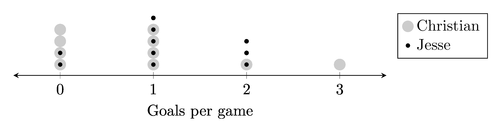

====================================================
Parallel Overlay Dot plots
====================================================

| To build parallel overlay dot plots diagrams, with one daigram below the other, python uses a .txt file and a .tex template.

| The python file to make parallel overlay dot plots is below.
| :download:`parallel_overlay_dot_plot_maker.py<files/parallel_overlay_dot_plot_maker.py>`

| The required LaTeX files are below.
| :download:`parallel_overlay_dot_plot_template.tex<files/parallel_overlay_dot_plot_template.tex>`

| The custom python modules required are:
| :download:`magick_pdf_to_png.py<files/magick_pdf_to_png.py>`

| A sample text file is below:
| :download:`pdp_goals.txt<files/pdp_goals.txt>`

----

LaTeX
-------------

| The .tex file template is shown below.

.. literalinclude:: files/parallel_overlay_dot_plot_template.tex
   :language: LaTeX

----

Txt file
------------

| The .txt file is shown below.
| 5 lines store data:
| line 1: the dot plot label
| line 2: the first data label
| line 3: a comma space separated list of numbers
| line 4: the second data label
| line 5: a comma space separated list of numbers

.. literalinclude:: files/pdp_goals.txt
   :language: text

----

Png file
------------

| The .png file is shown below.

----

Python code
------------

| The python code is shown below.

.. literalinclude:: files/parallel_overlay_dot_plot_maker.py
   :language: python
