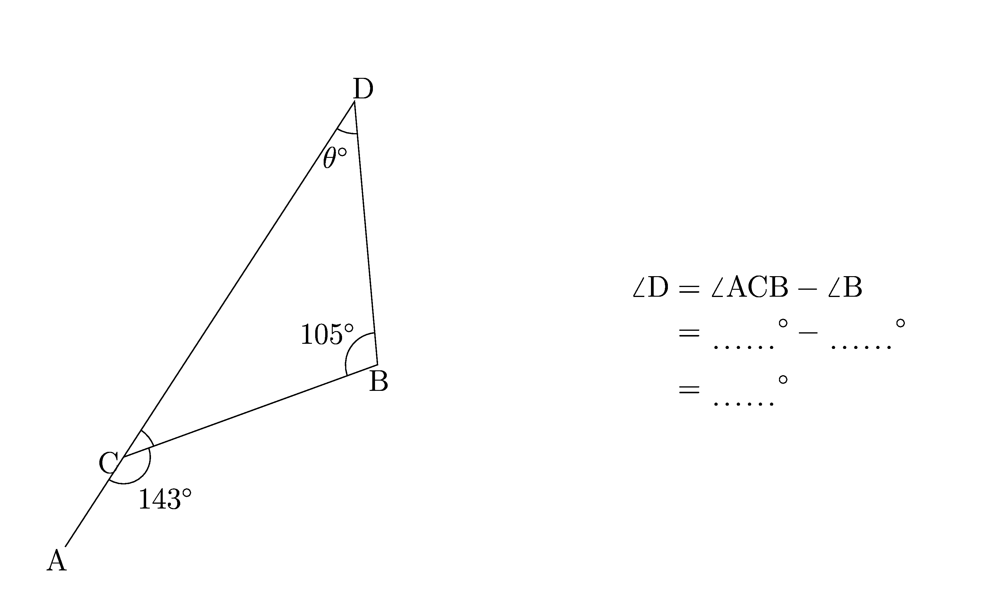
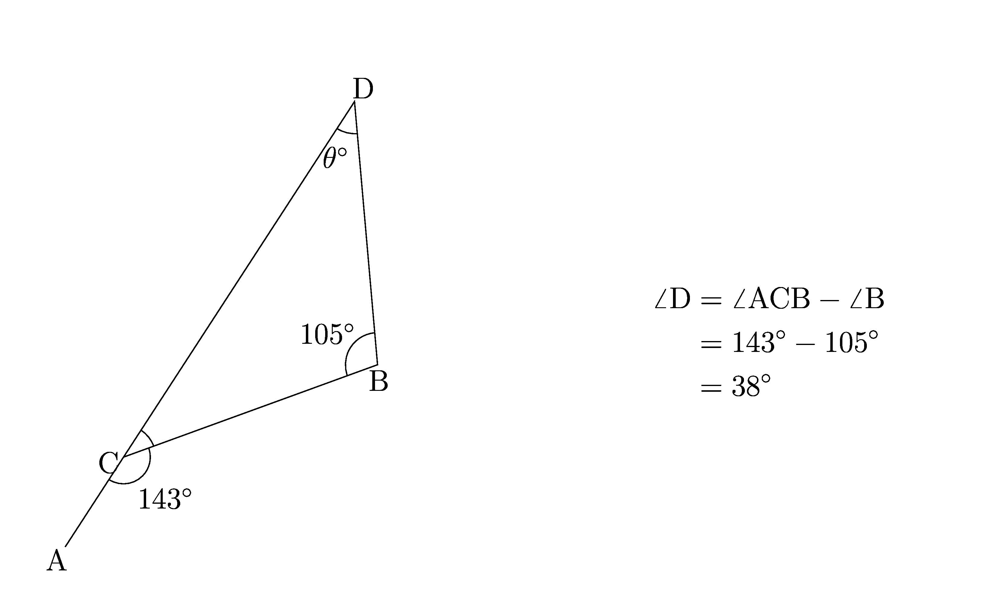

====================================================
Exterior Angle to triangle
====================================================

| The diagrams below show 2 angles: an angle exterior to a triangle and an opposite interior angle.
| The other opposite interior angle is to be calculated.
| These are python generated via LaTeX with separate question and answer sheet pdfs.

----

Sample Question and answer diagrams
------------------------------------------

| A sample question diagram is shown below.

| A sample answer diagram is shown below.

----

Sample Tex and pdf files
--------------------------------

| Question diagram files:
| :download:`ext_angle_to_triangle_1_q.tex<files/ext_angle_to_triangle_1_q.tex>`
| :download:`ext_angle_to_triangle_1_q.pdf<files/ext_angle_to_triangle_1_q.pdf>`

| Answer diagram files:
| :download:`ext_angle_to_triangle_1_ans.tex<files/ext_angle_to_triangle_1_ans.tex>`
| :download:`ext_angle_to_triangle_1_ans.pdf<files/ext_angle_to_triangle_1_ans.pdf>`

-----

Booklets using python
-----------------------------

| The booklet files below are generated using python and LaTeX templates.

Required files:

| :download:`ext_angle_to_triangle_booklet_ans_template<makers/ext_angle_to_triangle_booklet_ans_template.tex>`
| :download:`ext_angle_to_triangle_booklet_template<makers/ext_angle_to_triangle_booklet_template.tex>`
| :download:`ext_angle_to_triangle_booklet_diagram_template<makers/ext_angle_to_triangle_booklet_diagram_template.tex>`

| :download:`ext_angle_to_triangle_functions<makers/ext_angle_to_triangle_functions.py>`
| :download:`ext_angle_to_triangle_booklet_diagram_maker<makers/ext_angle_to_triangle_booklet_diagram_maker.py>`

----

Sample booklet Tex and pdf files
-------------------------------------

| Question sheet:
| :download:`ext_angle_to_triangle_Bk_20_q.tex<files/ext_angle_to_triangle_Bk_20_q.tex>`
| :download:`ext_angle_to_triangle_Bk_20_q.pdf<files/ext_angle_to_triangle_Bk_20_q.pdf>`

| Answer sheet:
| :download:`ext_angle_to_triangle_Bk_20_ans.tex<files/ext_angle_to_triangle_Bk_20_ans.tex>`
| :download:`ext_angle_to_triangle_Bk_20_ans.pdf<files/ext_angle_to_triangle_Bk_20_ans.pdf>`

