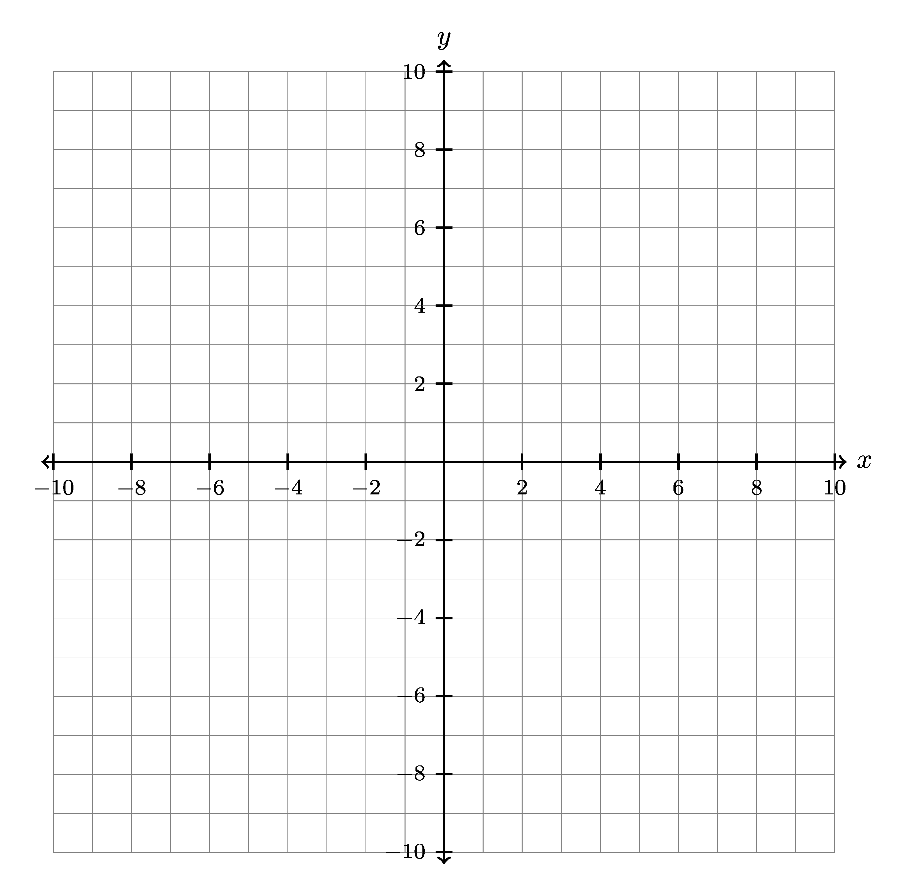

.. https://sphinx-design.readthedocs.io/en/rtd-theme/grids.html#grid-options

====================================================
Graph paper
====================================================

| Some simple graph papers are below with some explanations of the code.
| The document class used for a cropped picture is standalone.
| See: https://mirror.cse.unsw.edu.au/pub/CTAN/macros/LaTeX/contrib/standalone/standalone.pdf

.. grid:: 2
   :gutter: 0
   :margin: 0
   :padding: 0

   .. grid-item-card::  

      10by10
      ^^^
      :download:`png<files/graph_paper_10by10.png>`
      :download:`pdf<files/graph_paper_10by10.pdf>`
      :download:`tex<files/graph_paper_10by10.tex>`

      .. figure:: files/graph_paper_10by10.png
         :width: 300
         :alt: graph_paper_10by10
         :figclass: align-center

   .. grid-item-card::

      10by10_labels 
      ^^^
      :download:`png<files/graph_paper_10by10_labels.png>`
      :download:`pdf<files/graph_paper_10by10_labels.pdf>`
      :download:`tex<files/graph_paper_10by10_labels.tex>`

      .. figure:: files/graph_paper_10by10_labels.png
         :width: 300
         :alt: graph_paper_10by10_labels
         :figclass: align-center

.. grid:: 2
   :gutter: 0
   :margin: 0
   :padding: 0

   .. grid-item-card::

      10by10_labels_nos_1 
      ^^^
      :download:`png<files/graph_paper_10by10_labels_nos_1.png>`
      :download:`pdf<files/graph_paper_10by10_labels_nos_1.pdf>`
      :download:`tex<files/graph_paper_10by10_labels_nos_1.tex>`
 
      .. figure:: files/graph_paper_10by10_labels_nos_1.png
         :width: 300
         :alt: graph_paper_10by10_labels_nos_1
         :figclass: align-center

   .. grid-item-card::

      10by10_labels_nos_2
      ^^^
      :download:`png<files/graph_paper_10by10_labels_nos_2.png>`
      :download:`pdf <files/graph_paper_10by10_labels_nos_2.pdf>`
      :download:`tex<files/graph_paper_10by10_labels_nos_2.tex>`
 
      .. figure:: files/graph_paper_10by10_labels_nos_2.png
         :width: 300
         :alt: graph_paper_10by10_labels_nos_2
         :figclass: align-center

.. grid:: 3
   :gutter: 0
   :margin: 0
   :padding: 0

   .. grid-item-card::  
      
      5by5 
      ^^^
      :download:`png<files/graph_paper_5by5.png>`
      :download:`pdf<files/graph_paper_5by5.pdf>`
      :download:`tex<files/graph_paper_5by5.tex>`

      .. figure:: files/graph_paper_5by5.png
         :width: 200
         :alt: graph_paper_5by5
         :figclass: align-center

   .. grid-item-card::  
      
      5by5_labels 
      ^^^
      :download:`png<files/graph_paper_5by5_labels.png>`
      :download:`pdf<files/graph_paper_5by5_labels.pdf>`
      :download:`tex<files/graph_paper_5by5_labels.tex>`
 
      .. figure:: files/graph_paper_5by5_labels.png
         :width: 200
         :alt: graph_paper_5by5_labels
         :figclass: align-center

   .. grid-item-card::  
      
      5by5_labels_nos 
      ^^^
      :download:`png<files/graph_paper_5by5_labels_nos.png>`
      :download:`pdf<files/graph_paper_5by5_labels_nos.pdf>`
      :download:`tex<files/graph_paper_5by5_labels_nos.tex>`
 
      .. figure:: files/graph_paper_5by5_labels_nos.png
         :width: 200
         :alt: graph_paper_5by5_labels_nos
         :figclass: align-center

----

10 by 10 graph with ticks every 2
---------------------------------------

| The 10 by 10 graph, with axes labelled is below.

| The LaTeX for the graph is below.

.. literalinclude:: files/graph_paper_10by10_labels_nos_2.tex
   :language: LaTeX

Document class
~~~~~~~~~~~~~~~~~~

| The command ``\documentclass[border = 3mm]{standalone}`` is used to create a standalone document that shrinks the page to just contain the contents with a 3mm border around it.

Help lines
~~~~~~~~~~~~~~~~~~

| The command ``\draw[help lines, step = 0.5cm] (-5, -5) grid (5, 5)`` is used to draw a grid of horizontal and vertical lines that are spaced 0.5cm apart. 
| The help lines option specifies that the lines should be thin and gray. 
| The ``step = 0.5cm`` option specifies the distance between the lines. 
| The coordinates ``(-5, -5)`` and ``(5, 5)`` specify the lower-left and upper-right corners of the grid.

Axes
~~~~~~~~~~~~~~~~~~

| The command ``\draw[thick, <->] (0, -5.15) -- (0, 5.15) node[above] {$y$}`` is used to draw a vertical line that extends from -5.1 to 5.1 on the y-axis. 
| The thick option specifies that the line should be drawn with a thick stroke. 
| The ``<->`` option specifies that arrowheads should be added to both ends of the line. 
| The ``(0, -5.15)`` and ``(0, 5.15)`` specify the starting and ending points of the line. 
| The ``node[above] {$y$}`` adds a label "y" above the line.

| The for loops draw ticks at every 2 units from -10 to 10. 
| The command ``\foreach \x in {-10,-8,...,-2,2,4,...,10}`` is used to iterate over the list of numbers from -10 to 10 with a step of 2. 
| The command ``\draw [thick] (\x cm/2,3pt) -- (\x cm/2,-3pt)`` is used to draw a thick line at each tick mark from ``3pt`` above to ``-3pt`` below the number line. 
| Since the number line goes from -10 to +10 over 10 cm, ``\x cm/2`` is required to position the ticks correctly. 
| The command ``node[anchor=north] {\fontsize{8}{11}\selectfont$\x$}`` is used to label each tick mark with its corresponding number.

