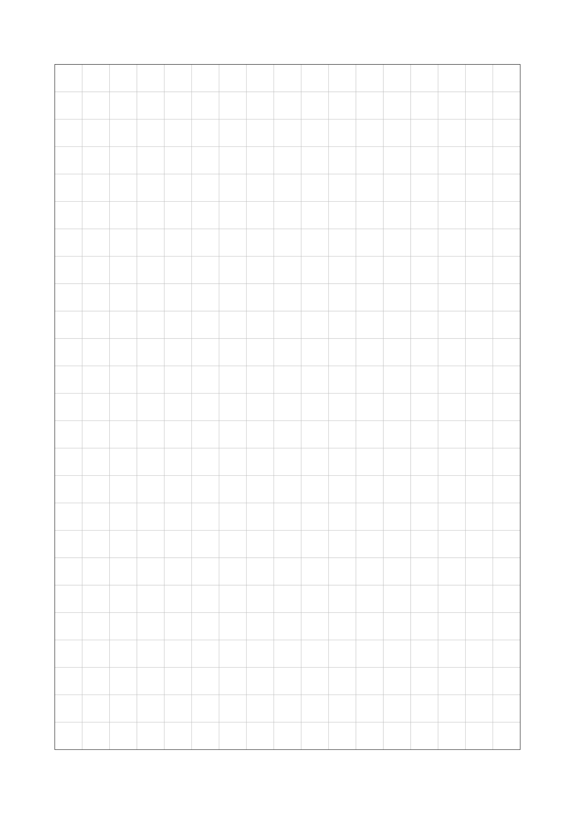
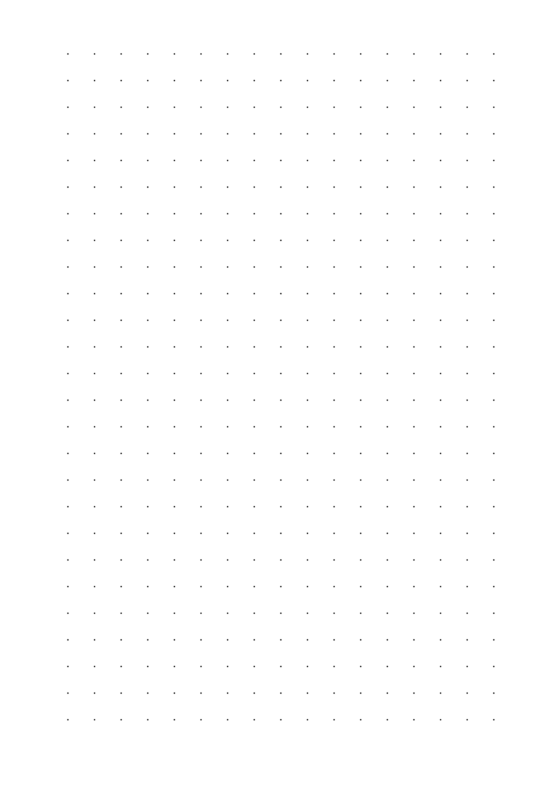
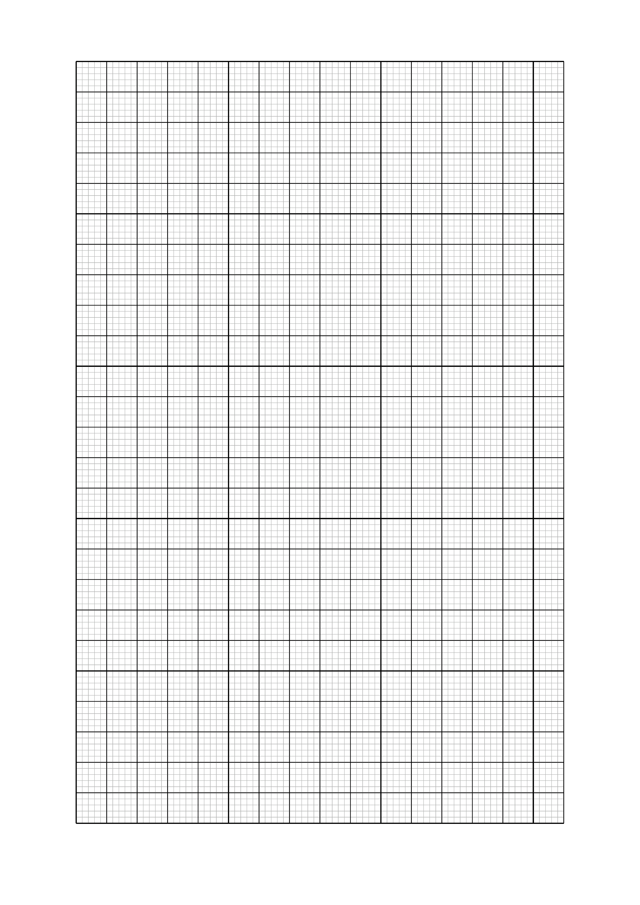

====================================================
Grids
====================================================

| Grids can be made using LaTeX.

.. grid:: 2
   :gutter: 0
   :margin: 0
   :padding: 0

   .. grid-item-card::  
      
      grid_1cm_squares
      ^^^
      :download:`png<files/grid_1cm_squares.png>`
      :download:`pdf<files/grid_1cm_squares.pdf>`
      :download:`tex<files/grid_1cm_squares.tex>`

      .. figure:: files/grid_1cm_squares.png
         :width: 300
         :alt: grid_1cm_squares
         :figclass: align-center

   .. grid-item-card::  

      grid_dots
      ^^^
      :download:`png<files/grid_dots.png>`
      :download:`pdf<files/grid_dots.pdf>`
      :download:`tex<files/grid_dots.tex>`

      .. figure:: files/grid_dots.png
         :width: 300
         :alt: grid_dots
         :figclass: align-center
         

.. grid:: 2
   :gutter: 0
   :margin: 0
   :padding: 0

   .. grid-item-card::  
      
      grids_10by10cm
      ^^^
      :download:`png<files/grids_10by10cm.png>`
      :download:`pdf<files/grids_10by10cm.pdf>`
      :download:`tex<files/grids_10by10cm.tex>`

      .. figure:: files/grids_10by10cm.png
         :width: 300
         :alt: grids_10by10cm
         :figclass: align-center

   .. grid-item-card::  

      grids_16by25cm
      ^^^
      :download:`png<files/grids_16by25cm.png>`
      :download:`pdf <files/grids_16by25cm.pdf>`
      :download:`tex<files/grids_16by25cm.tex>`

      .. figure:: files/grids_16by25cm.png
         :width: 300
         :alt: grids_16by25cm
         :figclass: align-center

----

1cm squares
---------------------

| A grid of 1cm squares can be made with the gridpapers package.
| See the gridpapers package docs at: 
| https://mirror.cse.unsw.edu.au/pub/CTAN/macros/LaTeX/contrib/gridpapers/gridpapers.pdf

.. literalinclude:: files/grid_1cm_squares.tex
   :language: LaTeX

gridpapers
~~~~~~~~~~~~~~~~

| This line of LaTeX code ``\usepackage[pattern=std,patternsize=10mm,colorset=std, majorcolor=black,minorcolor=lightgray,textarea, geometry={a4paper, portrait, hmargin=2cm, vmargin=2.35cm}]{gridpapers}`` loads the ``gridpapers`` package with the following options:

- ``patternsize=10mm``: sets the size of the pattern to 10mm.
- ``majorcolor=black``: sets the color of the major grid lines to black (outer border lines).
- ``minorcolor=lightgray``: sets the color of the minor grid lines to light gray.

geometry
~~~~~~~~~~~~~~~

| ``geometry={a4paper, portrait, hmargin=2cm, vmargin=2.35cm}``: sets the page geometry to A4 paper size with portrait orientation and 2cm margins on the left and right sides and 2.35cm margins on the top and bottom sides.

----

TikZ
------------

| The following LaTeX uses **draw** or **filldraw** from the TikZ package. 
| See: https://en.wikibooks.org/wiki/LaTeX/PGF/TikZ

----

dots at 1cm
---------------------

| A grid of dots 1cm apart can be made by drawing small circles.

.. literalinclude:: files/grid_dots.tex
   :language: LaTeX

| The command ``\filldraw[black] (\x,\y) circle (.5pt)`` draws circles with a radius of 0.5pt. The command fills the circle with black color and draws its border.
| See: https://LaTeXdraw.com/tikz-shapes-circle/

----

graph paper grids 10 by 10cm
--------------------------------

| The LaTeX code below is for 10 by 10 cm graph paper with small squares every 2mm, large squares every 1cm.

.. literalinclude:: files/grids_10by10cm.tex
   :language: LaTeX

.. image:: files/grids_10by10cm.png
    :width: 600

----

graph paper grids 16 by 25cm
--------------------------------

| The LaTeX code below is for A4 16 by 25cm graph paper with small squares every 2mm, large squares every 1cm.

.. literalinclude:: files/grids_16by25cm.tex
   :language: LaTeX

| The command ``\draw[step=2mm, line width=0.1mm, black!30!white] (0,0) grid (\width,\height)`` is used to draw a grid. 
| The ``step`` argument specifies the distance between the lines of the grid. 
| The ``line width`` argument specifies the thickness of the lines. 
| The ``black!30!white`` argument specifies the color of the lines as a blend of 30% black and 70% white.
| The ``(0,0)`` argument specifies the starting point of the grid and ``(\width,\height)`` specifies the ending point, defined as (16,25). 

