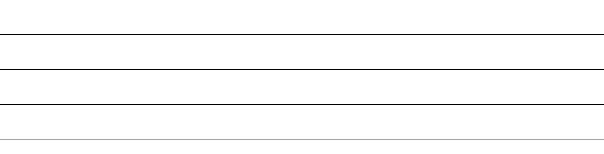
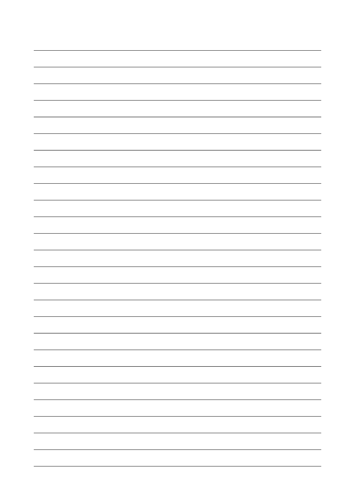

====================================================
Lined paper
====================================================

| Lines for writing on can be made in LaTeX.
| A4 size is 21 x 29.7 cm
| Making lines in Word using underscores is easier and more straightforward.

.. grid:: 4
   :gutter: 0
   :margin: 0
   :padding: 0

   .. grid-item-card::  

      lined_paper2
      ^^^
      :download:`png<files/lined_paper2.png>`
      :download:`pdf<files/lined_paper2.pdf>`
      :download:`tex<files/lined_paper2.tex>`

      .. figure:: files/lined_paper2.png
         :width: 150
         :alt: lined_paper2
         :figclass: align-center

   .. grid-item-card::  
      
      lined_paper4
      ^^^
      :download:`png<files/lined_paper4.png>`
      :download:`pdf<files/lined_paper4.pdf>`
      :download:`tex<files/lined_paper4.tex>`

      .. figure:: files/lined_paper4.png
         :width: 150
         :alt: lined_paper4
         :figclass: align-center

   .. grid-item-card::  
      
      lined_paper6
      ^^^
      :download:`png<files/lined_paper6.png>`
      :download:`pdf<files/lined_paper6.pdf>`
      :download:`tex<files/lined_paper6.tex>`

      .. figure:: files/lined_paper6.png
         :width: 150
         :alt: lined_paper6
         :figclass: align-center

   .. grid-item-card::
       
      lined_page
      ^^^
      :download:`png<files/lined_page.png>`
      :download:`pdf <files/lined_page.pdf>`
      :download:`tex<files/lined_page.tex>`

      .. figure:: files/lined_page.png
         :width: 150
         :alt: lined_page
         :figclass: align-center

----

2 lines
-------------

| This code will draw 2 lines, 28pt apart, from edge to edge, with 2cm trimmed from both sides of A4 paper.

.. literalinclude:: files/lined_paper2.tex
   :language: LaTeX

----

4 lines
-------------

| This code will draw 4 lines, 28pt apart, from edge to edge, with 2cm trimmed from both sides of A4 paper.

.. literalinclude:: files/lined_paper4.tex
   :language: LaTeX

----

6 lines
-------------

| This code will draw 6 lines, 28pt apart, from edge to edge, with 2cm trimmed from both sides of A4 paper.

.. literalinclude:: files/lined_paper6.tex
   :language: LaTeX

----

Code explanations
----------------------

geometry options
~~~~~~~~~~~~~~~~~~~~~~

| The code ``\usepackage[paperheight=70pt, paperwidth=17cm]{geometry}`` is used to set paper height to **70pt** and the paper width to **17cm**¹.
| See:The geometry package. http://web.mit.edu/texsrc/source/LaTeX/geometry/manual.pdf

pagestyle
~~~~~~~~~~~~~~~~~~~~~~

| The code ``\pagestyle{empty}`` is used to set the page style to **empty** which means that both the header and footer of the page will be empty.
| See: https://tex.stackexchange.com/questions/194423/page-style-plain-vs-empty

tikzpicture options
~~~~~~~~~~~~~~~~~~~~~~

| The code ``\begin{tikzpicture}[remember picture,overlay]`` with the ``remember picture`` option allows the TikZ picture to remember its position on the page while the ``overlay`` option allows the TikZ picture to be placed on top of other content. These combine to allow the placement of each line.

draw options
~~~~~~~~~~~~~~~~~~~~~~

| The code ``\draw[black,line width=0.5pt] (current page.north west) ++(0cm,-\y pt) -- ++(\paperwidth-0cm,0)`` is used to draw a black with a line width of 0.5pt. 
| The ``(current page.north west) ++(0cm,-\y pt)`` uses vector addition to get the starting point of the line by moving, from the top left of the page, down the y value taken from the for-loop.
| The ``++`` updates the current position for the next position calculation.
| A single ``+`` would do the vector addition without updating the current position.
| See: https://tex.stackexchange.com/questions/113283/confused-at-and-in-tikz
| The ``++(\paperwidth-0cm,0)`` gets the end position by moving left the paperwidth.
| The ``-0cm`` has been left in place in case future adjustments are wanted.

----

Lined page
--------------

| This code will draw a fully lined page, 28pt apart, from edge to edge, with 2cm margins for the A4 paper.

.. literalinclude:: files/lined_page.tex
   :language: LaTeX

