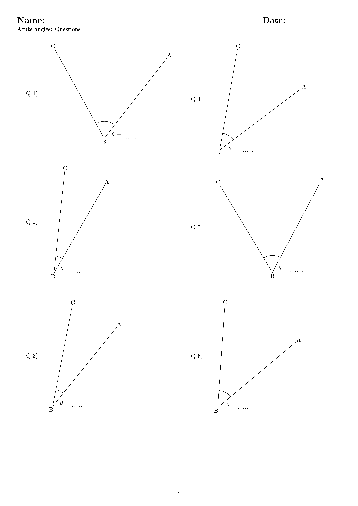
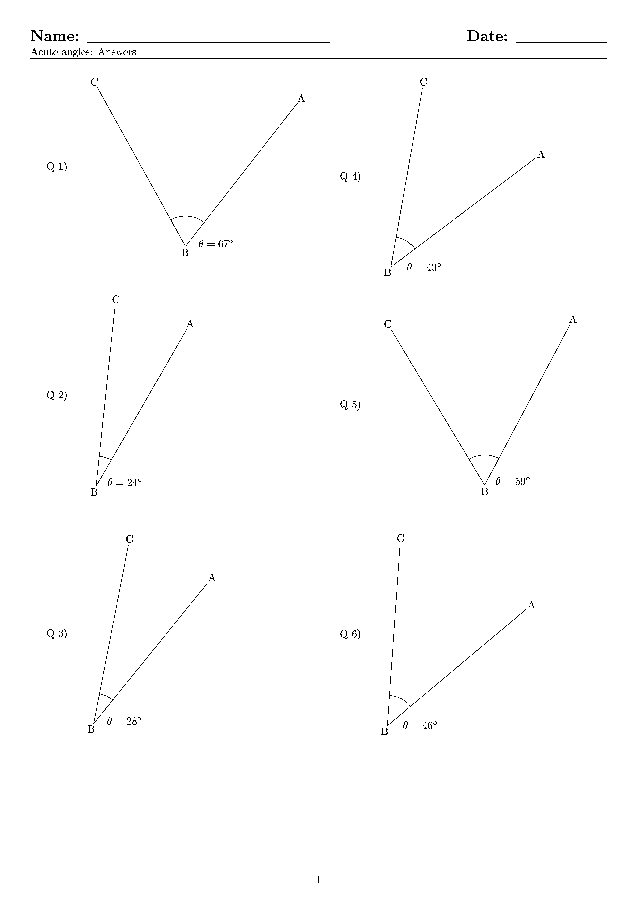

====================================================
Measuring angles
====================================================

| Diagrams of acute, obtuse and reflex angles are below.
| These are LaTeX generated only with the answer sheet first followed by the question sheet in the pdfs.

----

Question page
------------------
| A sample question page file is shown below.

----

Answer page
------------------

| A sample answer page file is shown below.

----

Tex and pdf files
--------------------

| A 2 page worksheet for acute angles:
| :download:`measuring_angles_acute_ws2.tex<files/measuring_angles_acute_ws2.tex>`
| :download:`measuring_angles_acute_ws2.pdf<files/measuring_angles_acute_ws2.pdf>`

| A 2 page worksheet for obtuse angles:
| :download:`measuring_angles_obtuse_ws2.tex<files/measuring_angles_obtuse_ws2.tex>`
| :download:`measuring_angles_obtuse_ws2.pdf<files/measuring_angles_obtuse_ws2.pdf>`

| A 2 page worksheet for reflex angles:
| :download:`measuring_angles_reflex_ws2.tex<files/measuring_angles_reflex_ws2.tex>`
| :download:`measuring_angles_reflex_ws2.pdf<files/measuring_angles_reflex_ws2.pdf>`

-----

Acute angles
--------------------

| The .tex file to regenerate random acute angles is shown below.

.. literalinclude:: files/measuring_angles_acute_ws2.tex
   :language: LaTeX

-----

Obtuse angles
--------------------

| The .tex file to regenerate random obtuse angles is shown below.

.. literalinclude:: files/measuring_angles_obtuse_ws2.tex
   :language: LaTeX

-----

Reflex angles
--------------------

| The .tex file to regenerate random reflex angles is shown below.

.. literalinclude:: files/measuring_angles_reflex_ws2.tex
   :language: LaTeX

