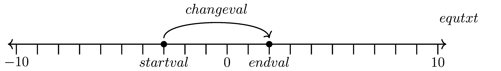

====================================================
Number Lines - manual
====================================================

| The LaTeX in this section is for one number line diagram.
| The values in the diagram can be entered manually into the LaTeX code.

----

A number line diagram with answers
--------------------------------------------

.. grid:: 1
   :gutter: 0
   :margin: 0
   :padding: 0

   .. grid-item-card::  

      question
      ^^^
      :download:`png<manual/number_lines_mq.png>`
      :download:`pdf<manual/number_lines_mq.pdf>`
      :download:`tex<manual/number_lines_mq.tex>`

      .. figure:: manual/number_lines_mq.png
         :width: 600
         :alt: number_lines_mq
         :figclass: align-center

   .. grid-item-card::  
      
      answer
      ^^^
      :download:`png<manual/number_lines_mans.png>`
      :download:`pdf<manual/number_lines_mans.pdf>`
      :download:`tex<manual/number_lines_mans.tex>`

      .. figure:: manual/number_lines_mans.png
         :width: 600
         :alt: number_lines_mans
         :figclass: align-center

----

number lines LaTeX
---------------------------

A LaTeX .tex file consists of two parts, the preamble and the main document. 

----

LaTeX preamble
----------------------

| In the preamble, set the document class, and import required packages and set their options.
| Macro definitions, such as those for the variables to hold the diagram values, are also in the preamble.

.. code-block:: LaTeX

    % numberline
    \documentclass[preview,12pt]{standalone}
    \usepackage{tikz}
    \usetikzlibrary{positioning}
    \usetikzlibrary {arrows.meta}
    \usetikzlibrary{bending}
    \usepackage[a4paper, portrait, margin=1cm]{geometry}
    
    \def\jumpheight{10}
    \def\qgap{\rule[-1pt]{1.0em}{.25pt}}

    % modify values for number lines
    \def\startval{-3}
    \def\endval{2}
    % values for display
    \def\startvaltxt{\startval}
    \def\endvaltxt{\endval}
    \def\changevaltxt{+5}
    \def\equtxt{-3 + 5 = 2}
    % end modify values for number lines

Document class
~~~~~~~~~~~~~~~~~~~

| The code ``\documentclass[preview,12pt]{standalone}`` is used to define a document that can be used to create graphics that are self-contained and can be easily included in other documents. 
| The argument `[12pt]` specifies the base font size of the document.
| See: https://mirror.cse.unsw.edu.au/pub/CTAN/macros/LaTeX/contrib/standalone/standalone.pdf

tikz package
~~~~~~~~~~~~~~~~~~~

| The code ``\usepackage{tikz}`` imports the TikZ package which allows you to create diagrams and graphics programmatically, such as points, lines and paths, circles, ellipses and rectangles.
| The code ``\usetikzlibrary{positioning}`` is used to import the positioning library which provides advanced positioning options for nodes (points in a diagram that can be referenced and used to draw lines or shapes).
| The code ``\usetikzlibrary{arrows.meta}`` loads the `arrows.meta` library, which provides more options for customizing the appearance of arrows in `tikz` diagrams. This library allows you to use different arrow tip styles and to adjust the size and shape of arrow tips.
| The code ``\usetikzlibrary{bending}`` loads the `bending` library, which improves the appearance of arrows that are attached to curved lines. This library makes the arrow tips follow the curvature of the line, resulting in a more natural-looking bend.
| For docs on the tikz package see: https://tikz.dev/

arrows
~~~~~~~~~~~~~~~~~~~

| Use ``\usetikzlibrary {arrows.meta}`` and ``\usetikzlibrary{bending}`` to create various types of arrows with TikZ.
| The arrows.meta library provides a flexible way to customize the appearance of arrow tips, such as their shape, size, color, and orientation. 
| The bending library allows curved paths with arrows to be drawn without distortion.

Macro definitions
~~~~~~~~~~~~~~~~~~

| The macro ``\def\jumpheight{10}`` is used for consistency and easy adjustment of the height that the arrow goes up from the points in the number line.
| The macro ``\def\qgap{\rule[-1pt]{1.0em}{.25pt}}`` is used for placing an underline for space to write answers on a number line used in a question.

| The variables to be used are shown below in the Macro definitions.
| These will be used in creating the number line diagram.
| This allows a user to replace the values that show on the number line diagram, here, in one place, instead of in the LaTeX code for the diagram itself.

.. code-block:: LaTeX

    % modify values for number lines
    \def\startval{-3}
    \def\endval{2}
    % values for display
    \def\startvaltxt{\startval}
    \def\endvaltxt{\endval}
    \def\changevaltxt{+5}
    \def\equtxt{-3 + 5 = 2}
    % end modify values for number lines

Macro definitions and Variables
~~~~~~~~~~~~~~~~~~~~~~~~~~~~~~~~~~

| The command ``\def`` is used to define new commands in LaTeX. 
| The syntax for defining a new command is ``\def\commandname{replacement text}``.
| When the command is used in the document, LaTeX replaces it with the replacement text.

| The command ``\def\startval{-3}`` defines a new command named, ``\startval``, that takes no arguments and expands to the text ``-3``. 
| Later in the code, this will be used to mark the point at -3 on the number line.

| The number line diagram shows the names of the variables used for each part of the diagram.

----------------------------------------
The document environment
----------------------------------------

| The tikzpicture part of the document environment is below.
| It contains nodes with names to identify each position used to the points on a number line, the arrow above it connecting the 2 points and the equation it represents. 

.. code-block:: LaTeX

    \begin{document}
    \begin{tikzpicture}[scale=0.75]
        % axis, arrow style to-to
        \draw[{To[scale=1.3]}-{To[scale=1.3]}, line width=1pt] (-10.4, 0) -- (10.4, 0);  
        % tick marks
        \foreach \x in {-10,-9,...,10}
            \draw[shift={(\x,0)},color=black, line width=1pt] (0pt,-14pt) -- (0pt,0pt);
        % numbers along each axis
        \foreach \x in {-10,0,10}
            \draw[shift={(\x,-0.8)},color=black] node[font=\large,text height=12pt] {$\x$};
        % to display variables
        \draw[shift={(\startval,-0.8)},color=black] node[font=\large,text height=12pt] {$\startvaltxt$};
        \draw[shift={(\endval,-0.8)},color=black] node[font=\large,text height=12pt] {$\endvaltxt$};
        % dots
        \filldraw[black] (\startval,0) circle (4pt) node[above,yshift=-2pt] (a) {};
        \filldraw[black] (\endval,0) circle (4pt) node[above,yshift=-2pt] (b) {}; 
        % arrow
        \draw[-{To[scale=1.3, bend]},line width=1pt, color=black] (a.north)  .. controls  +(north:\jumpheight mm) and +(north:\jumpheight mm) .. node[above=2pt,text height=12pt,font=\large]{$\changevaltxt$} (b.north);
        % equation at right end
        \node [font=\large, minimum width=30mm] at (11.0,1.2) {$\equtxt$};
    \end{tikzpicture}
    \end{document}

Document
~~~~~~~~~~~~~~~~

| The command ``\begin{document}`` starts the body of the document. It is used to indicate the beginning of the text that will be typeset to appear in the output pdf. 
| The ``\end{document}`` command marks the end of the document

tikzpicture
~~~~~~~~~~~~~~~~~~~~~~~~

| ``\begin{tikzpicture}`` is a command in LaTeX that creates a new picture environment.

Diagram parts
~~~~~~~~~~~~~~~~~~~~~~~~

These LaTeX lines create a graphic element using the **tikzpicture** environment, which is part of the **TikZ** package for creating diagrams. The lines do the following:

- ``\begin{tikzpicture}[scale=0.75]`` starts the tikzpicture environment and sets the scale option to 0.80, which means that the graphic will be scaled down by 20%. This enables the line to be drawn with one tick every 1 cm before scaling it to fit on an A4 page.
- ``\draw[{To[scale=1.3]}-{To[scale=1.3]}, line width=1pt] (-10.4, 0) -- (10.4, 0)``draws a horizontal line from (-10.4, 0) to (10.4, 0) with a thickness of 1pt and arrow tips at both ends. The arrow tips are customized using the **arrows.meta** library and the **To** shape with a scale of 1.3.
- ``\foreach \x in {-10,-9,...,10}`` starts a loop that assigns values to the variable \x from -10 to 10 with increments of 1.
- ``\draw[shift={(\x,0)},color=black, line width=1pt] (0pt,-14pt) -- (0pt,0pt)`` draws a vertical line segment from (0pt,-14pt) to (0pt,0pt) for each value of \x, shifting the origin to (\x,0) and using black color and 1pt thickness.
- ``\foreach \x in {-10,0,10}`` starts another loop that assigns values to the variable \x for -10, 0 and 10.
- ``\draw[shift={(\x,-0.8)},color=black] node[font=\large,text height=12pt] {$\x$}`` places a node with the value of \x below each tick mark on the horizontal axis, using a large font and a text height of 12pt.
- ``\draw[shift={(\startval,-0.8)},color=black] node[font=\large,text height=12pt] {$\startvaltxt$}`` places a node with the value of ``\startvaltxt`` below the tick mark corresponding to ``\startval`` on the horizontal axis, using a large font and a text height of 12pt.
- ``\draw[shift={(\endval,-0.8)},color=black] node[font=\large,text height=12pt] {$\endvaltxt$}`` places a node with the value of ``\endvaltxt`` below the tick mark corresponding to ``\endval`` on the horizontal axis, using a large font and a text height of 12pt.
- ``\filldraw[black] (\startval,0) circle (4pt) node[above,yshift=-2pt] (a) {}`` fills and draws a black circle with a radius of 4pt at ``(\startval,0)`` and names it ``(a)``. It also places an empty node above the circle with a vertical shift of -2pt.
- ``\filldraw[black] (\endval,0) circle (4pt) node[above,yshift=-2pt] (b) {}`` fills and draws a black circle with a radius of 4pt at ``(\endval,0)`` and names it ``(b)``. It also places an empty node above the circle with a vertical shift of -2pt.
- ``\draw[-{To[scale=1.3, bend]},line width=1pt, color=black] (a.north) .. controls +(north:\jumpheight mm) and +(north:\jumpheight mm) .. node[above=2pt,text height=12pt,font=\large]{$\changevaltxt$} (b.north)`` draws a curved line from the north anchor of node ``(a)`` to the north anchor of node ``(b)``, using an arrow tip at the end with a scale of 1.3 and a bend option that makes it follow the curvature of the path. The line has a thickness of 1pt and a black color. The curve is controlled by two points that are relative to the start and end points, using the + notation (see: https://en.wikibooks.org/wiki/LaTeX/PGF/TikZ#Specifying_coordinates). The points are shifted north by ``\jumpheight`` mm. The line also has a node above it with a vertical shift of 2pt, a text height of 12pt, a large font, and the text ``\changevaltxt``.

----

number lines LaTeX
---------------------------

| The number lines LaTeX for the incomplete diagram is below.
| Some variable values have been commented out and replaced with empty values.

.. literalinclude:: manual/number_lines_mq.tex
   :linenos:

| The number lines LaTeX for the complete diagram is below.

.. literalinclude:: manual/number_lines_mans.tex
   :linenos:
   
