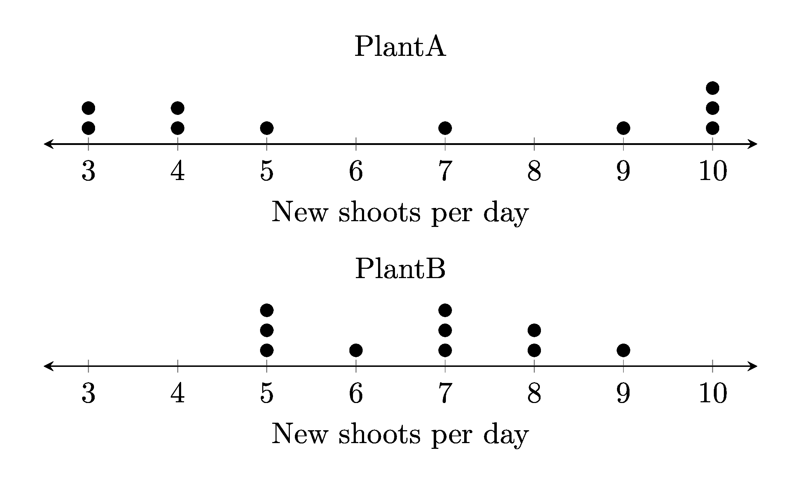

====================================================
Parallel Dot plots
====================================================

| To build parallel dot plots diagrams, with one daigram below the other, python uses a .txt file and a .tex template.

| The python file to make parallel dot plots is below.
| :download:`parallel_dot_plot_maker.py<files/parallel_dot_plot_maker.py>`

| The required LaTeX files are below.
| :download:`parallel_dot_plot_template.tex<files/parallel_dot_plot_template.tex>`

| The custom python modules required are:
| :download:`magick_pdf_to_png.py<files/magick_pdf_to_png.py>`

| A sample text file is below:
| :download:`pdp_plants.txt<files/pdp_plants.txt>`

----

Distribution generators
------------------------

| Some small python scripts to generate distributions are provided here:
| :download:`normal_hours.py<python_tools/normal_hours.py>`
| :download:`normal_diff_means.py<python_tools/normal_diff_means.py>`
| :download:`skewed_data.py<python_tools/skewed_data.py>`

----

Example parallel dot plots
-------------------------------------

.. grid:: 2
   :gutter: 0
   :margin: 0
   :padding: 0

   .. grid-item-card::  

      pdp_cafes
      ^^^
      :download:`png<files/pdp_cafes.png>`
      :download:`pdf<files/pdp_cafes.pdf>`
      :download:`tex<files/pdp_cafes.tex>`
      :download:`txt<files/pdp_cafes.txt>`

      .. figure:: files/pdp_cafes.png
         :width: 600
         :alt: pdp_cafes
         :figclass: align-center

   .. grid-item-card::

      pdp_early_late
      ^^^
      :download:`png<files/pdp_early_late.png>`
      :download:`pdf<files/pdp_early_late.pdf>`
      :download:`tex<files/pdp_early_late.tex>`
      :download:`txt<files/pdp_early_late.txt>`

      .. figure:: files/pdp_early_late.png
         :width: 600
         :alt: pdp_early_late
         :figclass: align-center

.. grid:: 2
   :gutter: 0
   :margin: 0
   :padding: 0

   .. grid-item-card::  

      pdp_plants
      ^^^
      :download:`png<files/pdp_plants.png>`
      :download:`pdf<files/pdp_plants.pdf>`
      :download:`tex<files/pdp_plants.tex>`
      :download:`txt<files/pdp_plants.txt>`

      .. figure:: files/pdp_plants.png
         :width: 300
         :alt: pdp_plants
         :figclass: align-center

   .. grid-item-card::  
      
      pdp_scores
      ^^^
      :download:`png<files/pdp_scores.png>`
      :download:`pdf<files/pdp_scores.pdf>`
      :download:`tex<files/pdp_scores.tex>`
      :download:`txt<files/pdp_scores.txt>`

      .. figure:: files/pdp_scores.png
         :width: 300
         :alt: pdp_scores
         :figclass: align-center

----

LaTeX
-------------

| The .tex file template is shown below.

.. literalinclude:: files/parallel_dot_plot_template.tex
   :language: LaTeX

----

Txt file
------------

| The .txt file is shown below.
| 5 lines store data:
| line 1: the dot plot label
| line 2: the first data label
| line 3: a comma space separated list of numbers
| line 4: the second data label
| line 5: a comma space separated list of numbers

.. literalinclude:: files/pdp_plants.txt
   :language: text

----

Png file
------------

| The .png file is shown below.

----

Python code
------------

| The python code is shown below.

.. literalinclude:: files/parallel_dot_plot_maker.py
   :language: pythonw
