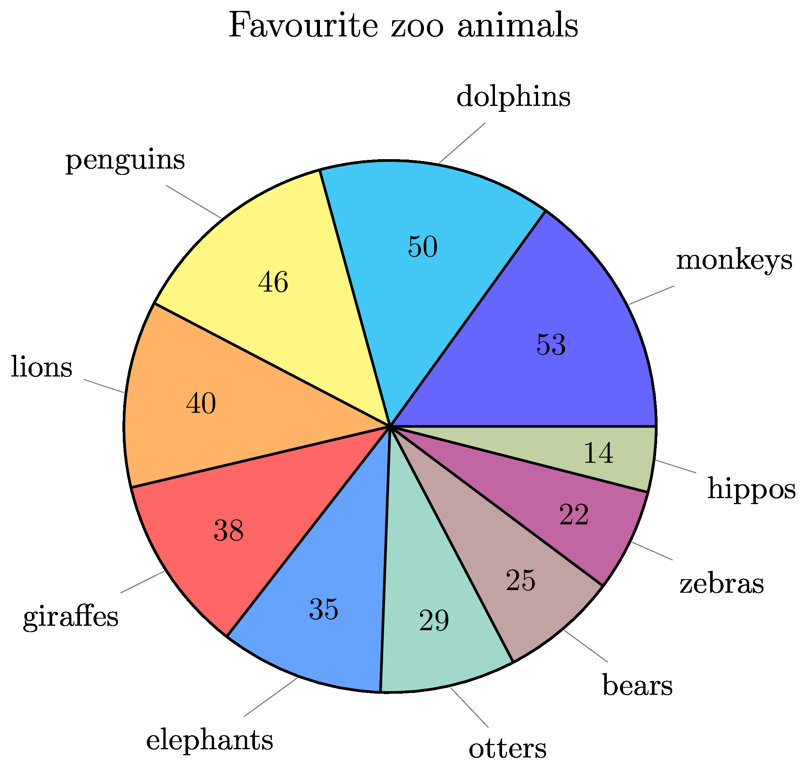

====================================================
Pie charts
====================================================

| Pie charts are a bar graph in sections, which often total to 100. (100%)

| The python file to make pie charts is below.
| :download:`pie_chart_maker.py<files/pie_chart_maker.py>`

| The required LaTeX files are below.
| :download:`pie_chart_template.tex<files/pie_chart_template.tex>`

| The custom python modules required are:
| :download:`magick_pdf_to_png.py<files/magick_pdf_to_png.py>`

| A sample text file is below:
| :download:`pc_zoo.txt<files/pc_zoo.txt>`

----

Example pie charts
-------------------------------------

.. grid:: 2
   :gutter: 0
   :margin: 0
   :padding: 0

   .. grid-item-card::  

      zoo
      ^^^
      :download:`png<files/pc_zoo.png>`
      :download:`pdf<files/pc_zoo.pdf>`
      :download:`tex<files/pc_zoo.tex>`
      :download:`txt<files/pc_zoo.txt>`

      .. figure:: files/pc_zoo.png
         :width: 600
         :alt: pc_zoo
         :figclass: align-center

   .. grid-item-card::

      participants
      ^^^
      :download:`png<files/pc_participants.png>`
      :download:`pdf<files/pc_participants.pdf>`
      :download:`tex<files/pc_participants.tex>`
      :download:`txt<files/pc_participants.txt>`

      .. figure:: files/pc_participants.png
         :width: 600
         :alt: pc_participants
         :figclass: align-center

.. grid:: 2
   :gutter: 0
   :margin: 0
   :padding: 0

   .. grid-item-card::  

      crust_elements
      ^^^
      :download:`png<files/pc_crust_elements.png>`
      :download:`pdf<files/pc_crust_elements.pdf>`
      :download:`tex<files/pc_crust_elements.tex>`
      :download:`txt<files/pc_crust_elements.txt>`

      .. figure:: files/pc_crust_elements.png
         :width: 600
         :alt: pc_crust_elements
         :figclass: align-center

   .. grid-item-card::

      icecream
      ^^^
      :download:`png<files/pc_icecream.png>`
      :download:`pdf<files/pc_icecream.pdf>`
      :download:`tex<files/pc_icecream.tex>`
      :download:`txt<files/pc_icecream.txt>`

      .. figure:: files/pc_icecream.png
         :width: 600
         :alt: pc_icecream
         :figclass: align-center

.. grid:: 2
   :gutter: 0
   :margin: 0
   :padding: 0

   .. grid-item-card::  

      outdoors
      ^^^
      :download:`png<files/pc_outdoors.png>`
      :download:`pdf<files/pc_outdoors.pdf>`
      :download:`tex<files/pc_outdoors.tex>`
      :download:`txt<files/pc_outdoors.txt>`

      .. figure:: files/pc_outdoors.png
         :width: 300
         :alt: pc_outdoors
         :figclass: align-center

   .. grid-item-card::  
      
      travel
      ^^^
      :download:`png<files/pc_travel.png>`
      :download:`pdf<files/pc_travel.pdf>`
      :download:`tex<files/pc_travel.tex>`
      :download:`txt<files/pc_travel.txt>`

      .. figure:: files/pc_travel.png
         :width: 300
         :alt: pc_travel
         :figclass: align-center

----

LaTeX
-------------

| The .tex file template is shown below.

.. literalinclude:: files/pie_chart_template.tex
   :language: LaTeX

----

Txt file
------------

| The .txt file is shown below.
| 3 lines store data:
| line 1: the plot title
| line 2: a comma separated sequence of numeric values
| line 3: a comma separated sequence of double quoted labels for the values

| A maximum number of entries for line 2 and line 3 is 10.
| Some characters need to be escaped manually such as \& for & and \% for % if used in line 1 or 3.

.. literalinclude:: files/pc_zoo.txt
   :language: text

----

Png file
------------

| The .png file is shown below.

----

Python code
------------

| The python code is shown below.

.. literalinclude:: files/pie_chart_maker.py
   :language: python
