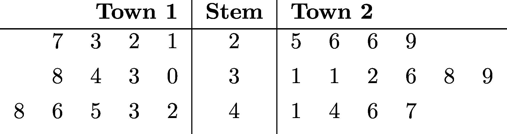

====================================================
Stem and Leaf plots
====================================================

| A stem and leaf plot is below.

LaTeX
-------------

.. literalinclude:: files/files/sl_btb_towns.tex
   :language: LaTeX

----

|  ``\documentclass [varwidth] {standalone}`` declares the document class as standalone with the varwidth option. This means that the document will only contain one picture or equation and will adjust its width to fit the content.
| ``\begin{document}`` marks the beginning of the document.
| ``\begin{table}[htbp]`` starts a table environment with the placement options htbp (here, top, bottom, page). This means that LaTeX will try to place the table where it is in the code, or at the top or bottom of a page, or on a separate page.

| ``\begin{tabular}{lllll\|c\|lllllll}`` starts a tabular environment with 13 columns. The argument {lllll\|c\|lllllll} specifies the alignment and vertical lines for each column. l means left-aligned, c means centered, and \| means a vertical line.

| ``\multicolumn{5}{r\|}{\textbf{Town 1}} & \textbf{Stem} & \multicolumn{6
}{l}{\textbf{Town 2}}\\[0.024cm]\hline`` creates a header row for the table. 
| The ``\multicolumn`` command spans multiple columns with a specified alignment and vertical line. 
| The ``\textbf`` command makes the text bold. 
| The ``\\`` command ends the row and adds some vertical space. 
| The ``\hline`` command draws a horizontal line.
| `` & 7 & 3 & 2 & 1 & 2 & 5 & 6 & 6 & 9 &   &\\[0.124cm]`` creates a data row for the table. The & symbol separates the columns. The empty columns are for spacing.
| ``\end{tabular}`` ends the tabular environment.
| ``\end{table}`` ends the table environment.
| ``\end{document}`` marks the end of the document. 

