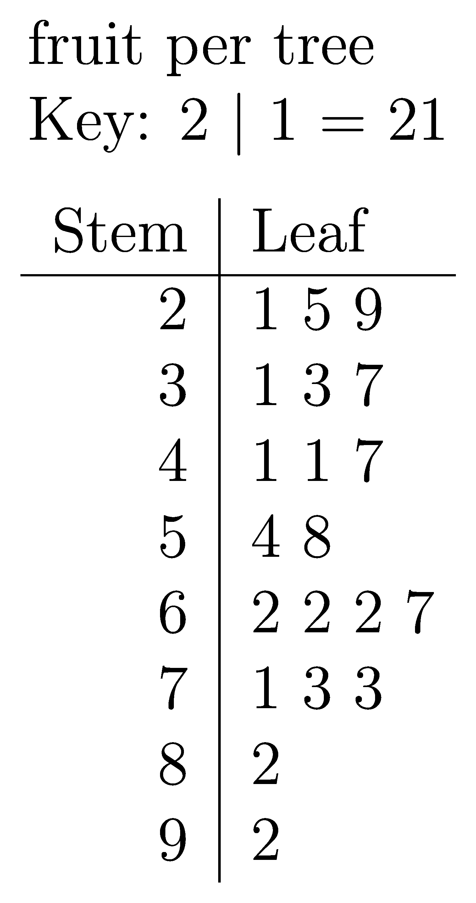

====================================================
Stem and Leaf plots
====================================================

| An example of a stem and leaf plot is below.

| The python file to make a stem and leaf plot is below.
| :download:`stem_and_leaf_maker.py<files/stem_and_leaf_maker.py>`

| The required LaTeX files are below.
| :download:`stem_and_leaf_template.tex<files/stem_and_leaf_template.tex>`

| The custom python modules required are:
| :download:`magick_pdf_to_png.py<files/magick_pdf_to_png.py>`

| A sample text file is below:
| :download:`sl_fruit.txt<files/sl_fruit.txt>`

----

Example stem and leaf plots
-------------------------------------

.. grid:: 2
   :gutter: 0
   :margin: 0
   :padding: 0

   .. grid-item-card::  

      fruit
      ^^^
      :download:`png<files/sl_fruit.png>`
      :download:`pdf<files/sl_fruit.pdf>`
      :download:`tex<files/sl_fruit.tex>`
      :download:`txt<files/sl_fruit.txt>`

      .. figure:: files/sl_fruit.png
         :width: 200
         :alt: sl_fruit
         :figclass: align-center

   .. grid-item-card::

      lengths
      ^^^
      :download:`png<files/sl_lengths.png>`
      :download:`pdf<files/sl_lengths.pdf>`
      :download:`tex<files/sl_lengths.tex>`
      :download:`txt<files/sl_lengths.txt>`

      .. figure:: files/sl_lengths.png
         :width: 300
         :alt: sl_lengths
         :figclass: align-center

.. grid:: 2
   :gutter: 0
   :margin: 0
   :padding: 0

   .. grid-item-card::  

     three_points
      ^^^
      :download:`png<files/sl_three_points.png>`
      :download:`pdf<files/sl_three_points.pdf>`
      :download:`tex<files/sl_three_points.tex>`
      :download:`txt<files/sl_three_points.txt>`

      .. figure:: files/sl_three_points.png
         :width: 300
         :alt: sl_three_points
         :figclass: align-center

   .. grid-item-card::

      sl_runs
      ^^^
      :download:`png<files/sl_runs.png>`
      :download:`pdf<files/sl_runs.pdf>`
      :download:`tex<files/sl_runs.tex>`
      :download:`txt<files/sl_runs.txt>`

      .. figure:: files/sl_runs.png
         :width: 300
         :alt: sl_runs
         :figclass: align-center

----

LaTeX
-------------

| The .tex file template is shown below.

.. literalinclude:: files/stem_and_leaf_template.tex
   :language: LaTeX

----

Txt file
------------

| The .txt file is shown below.
| 2 lines store data:
| line 1: the plot title
| line 2: a comma separated sequence of numeric values

.. literalinclude:: files/sl_fruit.txt
   :language: text

----

Png file
------------

| The .png file is shown below.

----

Python code
------------

| The python code is shown below.

.. literalinclude:: files/stem_and_leaf_maker.py
   :language: python

