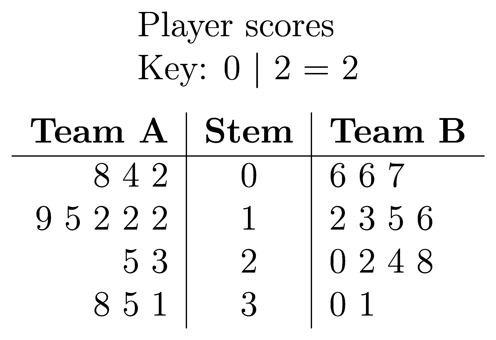

====================================================
Stem and Leaf plot: back-to-back
====================================================

| An example of a back-to-back stem and leaf plot is below.

| The python file to make a back-to-back stem and leaf plot is below.
| :download:`stem_and_leaf_btb_maker.py<files/stem_and_leaf_btb_maker.py>`

| The required LaTeX files are below.
| :download:`stem_and_leaf_btb_template.tex<files/stem_and_leaf_btb_template.tex>`

| The custom python modules required are:
| :download:`magick_pdf_to_png.py<files/magick_pdf_to_png.py>`

| A sample text file is below:
| :download:`slbtb_scores.txt<files/slbtb_scores.txt>`

----

Example back-to-back stem and leaf plots
-----------------------------------------

.. grid:: 2
   :gutter: 0
   :margin: 0
   :padding: 0

   .. grid-item-card::  

      scores
      ^^^
      :download:`png<files/slbtb_scores.png>`
      :download:`pdf<files/slbtb_scores.pdf>`
      :download:`tex<files/slbtb_scores.tex>`
      :download:`txt<files/slbtb_scores.txt>`

      .. figure:: files/slbtb_scores.png
         :width: 600
         :alt: slbtb_scores
         :figclass: align-center

   .. grid-item-card::

      heart_rates
      ^^^
      :download:`png<files/slbtb_heart_rates.png>`
      :download:`pdf<files/slbtb_heart_rates.pdf>`
      :download:`tex<files/slbtb_heart_rates.tex>`
      :download:`txt<files/slbtb_heart_rates.txt>`

      .. figure:: files/slbtb_heart_rates.png
         :width: 600
         :alt: slbtb_heart_rates
         :figclass: align-center

----

LaTeX
-------------

| The .tex file template is shown below.

.. literalinclude:: files/stem_and_leaf_btb_template.tex
   :language: LaTeX

----

Txt file
------------

| The .txt file is shown below.
| 2 lines store data:
| line 1: the plot title
| line 2: the label for the first group of values
| line 3: a comma space separated list of numbers
| line 4: the label for the second group of values
| line 5: a comma space separated list of numbers

.. literalinclude:: files/slbtb_scores.txt
   :language: text

----

Png file
------------

| The .png file is shown below.

----

Python code
------------

| The python code is shown below.

.. literalinclude:: files/stem_and_leaf_btb_maker.py
   :language: python

