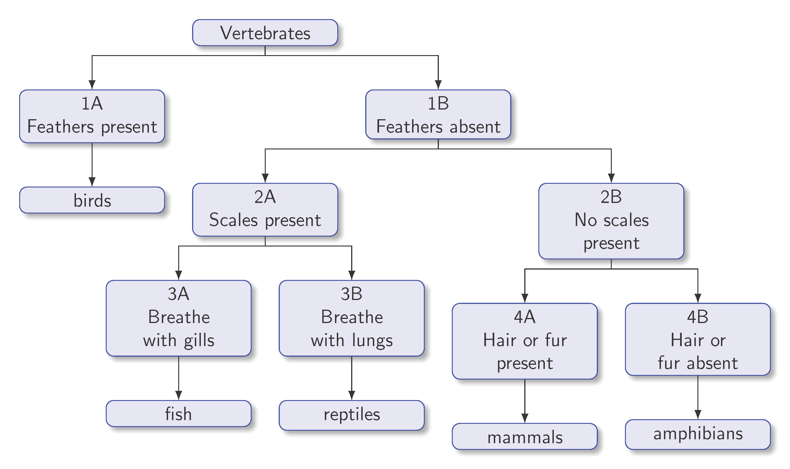
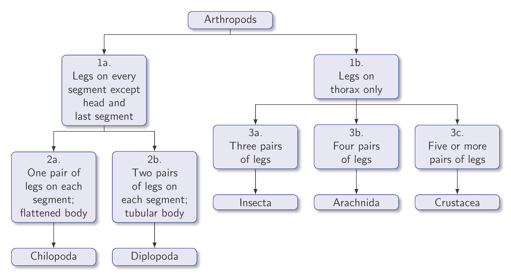

====================================================
Classification keys
====================================================

Tabular keys
---------------------

| Dichotomous tabular classification keys can be created in LaTeX using the tabular environment.

.. figure:: files/vertebrates_key.png
   :width: 300
   :alt: vertebrates_key.png
   :figclass: align-center

.. literalinclude:: files/vertebrates_key.tex
   :linenos:

| LaTeX usage:

- ``\documentclass[12pt, varwidth, border=5mm]{standalone}``: This line specifies the document class and its options. The ``standalone`` class is used for creating a standalone document with a single page. The ``12pt`` option sets the font size to 12 points. The ``varwidth`` option allows the content to determine the width of the page. The ``border=5mm`` option adds a 5mm border around the content.

- ``\begin{tabular}{l@{\hspace{1mm}}p{6cm}@{}r}``: This line begins a ``tabular`` environment, which is used to create a table. The argument ``{l@{\hspace{1mm}}p{6cm}@{}r}`` specifies the alignment and spacing of the columns. The ``l`` means that the first column is left-aligned. The ``@{\hspace{1mm}}`` syntax adds a 1mm space between the first and second columns. The ``p{6cm}`` means that the second column is a paragraph column with a fixed width of 6cm. The ``@{}`` syntax removes the space between the second and third columns. The ``r`` means that the third column is right-aligned.

- ``1A. & Feathers present \dotfill &\dotfill birds \\``: This line represents a row in the table. The ``&`` symbol separates the columns and the ``\\`` symbol marks the end of the row. The ``\dotfill`` command fills the space with dots.

----

.. figure:: files/arthropods_key.png
   :width: 600
   :alt: arthropods_key.png
   :figclass: align-center

.. literalinclude:: files/arthropods_key.tex
   :linenos:

| LaTeX usage:

- ``\documentclass[12pt, varwidth, border=5mm]{standalone}``: This line specifies the document class and its options. The ``standalone`` class is used for creating a standalone document with a single page. The ``12pt`` option sets the font size to 12 points. The ``varwidth`` option allows the content to determine the width of the page. The ``border=5mm`` option adds a 5mm border around the content.

- ``\begin{tabular}{l@{\hspace{1mm}}r}``: This line begins a ``tabular`` environment, which is used to create a table. The argument ``{l@{\hspace{1mm}}r}`` specifies the alignment and spacing of the columns. The ``l`` means that the first column is left-aligned. The ``@{\hspace{1mm}}`` syntax adds a 1mm space between the first and second columns. The ``r`` means that the second column is right-aligned.

- ``1a. & Legs on every segment except head and last segment \dots \dotfill go to 2 \\``: This line represents a row in the table. The ``&`` symbol separates the columns and the ``\\`` symbol marks the end of the row. The ``\dots`` command produces an ellipsis (three dots). The ``\dotfill`` command fills the space with dots.

----

Branching keys
---------------------

| The forest package can be used to draw branching diagrams.
| See docs at: https://ctan.org/pkg/forest?lang=en

.. literalinclude:: files/vertebrates_branching_key_forked_edges.tex
   :linenos:

.. literalinclude:: files/arthropods_branching_key_forked_edges.tex
   :linenos:

| Some of the LaTeX usage is below.

- ``\usepackage[edges]{forest}``: This line loads the ``forest`` package with the ``edges`` option. The ``forest`` package provides tools for creating tree diagrams, and the ``edges`` option enables additional features for customizing the appearance of edges in trees.

- ``\usetikzlibrary{arrows.meta,shadows.blur}``: This line loads two libraries from the ``tikz`` package: ``arrows.meta`` and ``shadows.blur``. The ``arrows.meta`` library provides additional arrow tip styles that can be used when drawing edges in trees, and the ``shadows.blur`` library provides a blur shadow effect that can be applied to nodes in trees.

- ``\begin{document}``: This line marks the beginning of the document content. Everything between this line and the corresponding ``\end{document}`` line will be processed by the LaTeX compiler and included in the output document.

- ``\begin{forest}``: This line begins a ``forest`` environment, which is used to create a tree diagram.

- ``forked edges,``: This option specifies that the edges connecting the nodes in the tree should be forked.

- ``for tree={...},``: This option allows you to specify formatting options that apply to all nodes in the tree. The options specified within the ``for tree`` block will apply to all nodes in the tree.

    - ``s sep=0.5cm,``: This option sets the distance between siblings (nodes that share the same parent) to 0.5 centimeters. This means that sibling nodes will be separated by a horizontal distance of 0.5 centimeters.

    - ``l sep=0.8cm,``: This option sets the distance between levels (nodes that are one level apart in the tree hierarchy) to 0.8 centimeters. This means that nodes that are one level apart will be separated by a vertical distance of 0.8 centimeters.

    - ``draw=blue!80!darkgray,``: This option sets the draw color for all nodes in the tree to a mixture of blue and dark gray.

    - ``fill=blue!10!white,``: This option sets the fill color for all nodes in the tree to a mixture of blue and white.

    - ``rounded corners,``: This option specifies that all nodes in the tree should have rounded corners.

    - ``text width=(\textwidth)/5,``: This option sets the text width for all nodes in the tree. The text width is calculated based on the value of ``\textwidth`` and a scaling factor of 5.

    - ``edge={-Latex},``: This option sets the style of the edges connecting the nodes in the tree. In this case, the edges are drawn with an arrowhead at the end using the ``-Latex`` arrow tip.

    - ``font=\sffamily,``: This option sets the font for all text within the tree to be sans-serif.

    - ``text centered,``: This option specifies that text within all nodes in the tree should be centered.

    - ``blur shadow,``: This option adds a blurred shadow effect behind all nodes in the tree.

