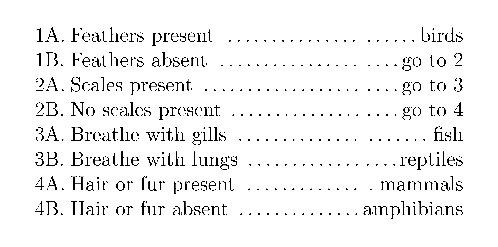

====================================================
Classification keys
====================================================

Tabular keys
---------------------

| Dichotomous tabular classification keys can be created in LaTeX using the tabular environment.

.. literalinclude:: files/vertebrates_key.tex
   :linenos:

| LaTeX usage:

- ``\documentclass[12pt, varwidth, border=5mm]{standalone}``: This line specifies the document class and its options. The ``standalone`` class is used for creating a standalone document with a single page. The ``12pt`` option sets the font size to 12 points. The ``varwidth`` option allows the content to determine the width of the page. The ``border=5mm`` option adds a 5mm border around the content.

- ``\begin{tabular}{l@{\hspace{1mm}}p{6cm}@{}r}``: This line begins a ``tabular`` environment, which is used to create a table. The argument ``{l@{\hspace{1mm}}p{6cm}@{}r}`` specifies the alignment and spacing of the columns. The ``l`` means that the first column is left-aligned. The ``@{\hspace{1mm}}`` syntax adds a 1mm space between the first and second columns. The ``p{6cm}`` means that the second column is a paragraph column with a fixed width of 6cm. The ``@{}`` syntax removes the space between the second and third columns. The ``r`` means that the third column is right-aligned.

- ``1A. & Feathers present \dotfill &\dotfill birds \\``: This line represents a row in the table. The ``&`` symbol separates the columns and the ``\\`` symbol marks the end of the row. The ``\dotfill`` command fills the space with dots.

----

.. figure:: files/arthropods_key.png
   :width: 600
   :alt: arthropods_key.png
   :figclass: align-center

.. literalinclude:: files/arthropods_key.tex
   :linenos:

| LaTeX usage:

- ``\documentclass[12pt, varwidth, border=5mm]{standalone}``: This line specifies the document class and its options. The ``standalone`` class is used for creating a standalone document with a single page. The ``12pt`` option sets the font size to 12 points. The ``varwidth`` option allows the content to determine the width of the page. The ``border=5mm`` option adds a 5mm border around the content.

- ``\begin{tabular}{l@{\hspace{1mm}}r}``: This line begins a ``tabular`` environment, which is used to create a table. The argument ``{l@{\hspace{1mm}}r}`` specifies the alignment and spacing of the columns. The ``l`` means that the first column is left-aligned. The ``@{\hspace{1mm}}`` syntax adds a 1mm space between the first and second columns. The ``r`` means that the second column is right-aligned.

- ``1a. & Legs on every segment except head and last segment \dots \dotfill go to 2 \\``: This line represents a row in the table. The ``&`` symbol separates the columns and the ``\\`` symbol marks the end of the row. The ``\dots`` command produces an ellipsis (three dots). The ``\dotfill`` command fills the space with dots.

----

Branching keys
---------------------

| The forest package can be used to draw branching diagrams.
| See docs at: https://ctan.org/pkg/forest?lang=en

.. figure:: files/vertebrates_branching_key_forked_edges.png
   :width: 600
   :alt: vertebrates_branching_key_forked_edges.png
   :figclass: align-center

.. literalinclude:: files/vertebrates_branching_key_forked_edges.tex
   :linenos:

.. figure:: files/arthropods_branching_key_forked_edges.png
   :width: 600
   :alt: arthropods_branching_key_forked_edges.png
   :figclass: align-center

.. literalinclude:: files/arthropods_branching_key_forked_edges.tex
   :linenos:

