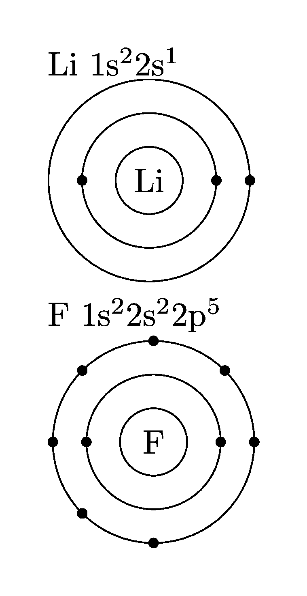

====================================================
Chemistry bohr LaTeX
====================================================

See: https://ctan.math.washington.edu/tex-archive/macros/latex/contrib/bohr/bohr_en.pdf
See: https://mirror.aarnet.edu.au/pub/CTAN/macros/latex/contrib/bohr/bohr_en.pdf
----

bohr
---------------

| The bohr package makes it easy to draw atomic structure digarams with orbitals.

.. literalinclude:: files/bohr_orbitals.tex
   :linenos:

| The electron configurations of Lithium (Li), Lithium ion (Li+), Fluorine (F) and Fluoride ion (F-) are drawn.

1. `\documentclass[varwidth,border = 5mm]{standalone}`: This line sets the document class to `standalone` with options `varwidth` and `border = 5mm`. The `standalone` class is used for creating stand-alone graphics or diagrams that can be included in other documents. The `varwidth` option allows the content to be wrapped in a box of variable width. The `border = 5mm` option sets a 5mm border around the content.

2. `\usepackage{bohr}`: This line loads the `bohr` package which provides commands for drawing Bohr models of atoms.

3. `\begin{document}`: This line marks the beginning of the document content.

4. `\setbohr{distribution-method=quantum,insert-missing,nucleus-options-set={black},shell-options-set={black},electron-options-set={black}}`: This line sets options for the `bohr` package. The `distribution-method=quantum` option specifies that electrons should be distributed according to quantum mechanics. The `insert-missing` option inserts missing shells in the Bohr model. The `nucleus-options-set={black}`, `shell-options-set={black}`, and `electron-options-set={black}` options set the color of the nucleus, shells, and electrons to black.

5. `\setbohr{nucleus-radius=1.5em}`: This line sets the radius of the nucleus to 1.5em.

6. `{Li } \elconf{3} \qquad \bohr{3}{Li}\qquad {Li+ } \elconf{2} \qquad \bohr{2}{Li+}\\`: This line draws the electron configurations of Lithium (Li) and Lithium ion (Li+) using the `\elconf` and `\bohr` commands. The `\elconf{3}` command draws the electron configuration of an atom with 3 electrons (Lithium). The `\bohr{3}{Li}` command draws a Bohr model of an atom with 3 electrons and a nucleus labeled "Li" (Lithium). The `\qquad` command inserts some horizontal space between elements.

7. `\vspace{24pt}\\`: This line inserts vertical space of 24 points.

8. `{F } \elconf{9} \qquad \bohr{9}{F} \qquad {F- } \elconf{10} \qquad \bohr{10}{F-}\\`: This line draws the electron configurations of Fluorine (F) and Fluoride ion (F-) using the same commands as in line 6.

9. `\end{document}`: This line marks the end of the document content.
