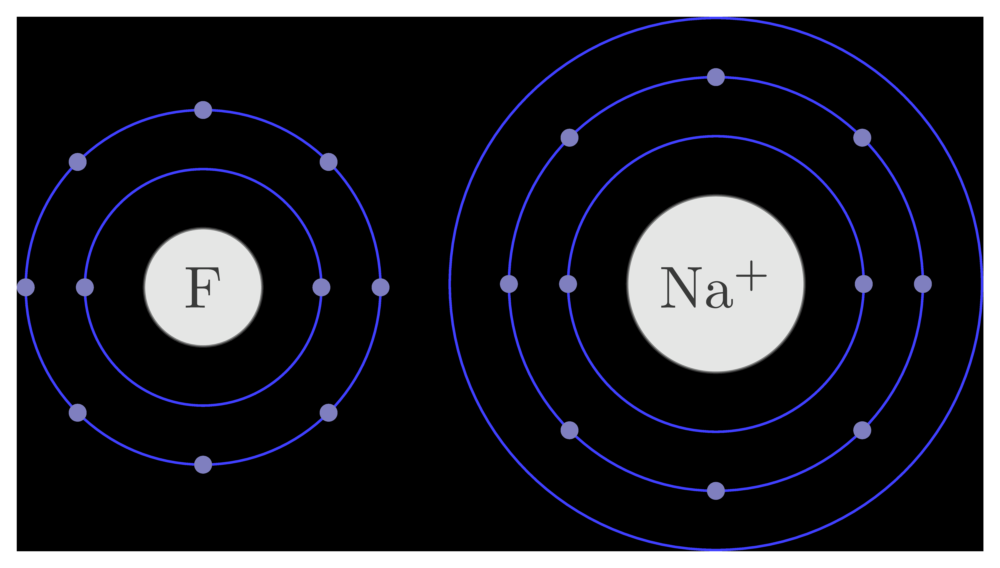

====================================================
Chemistry bohr LaTeX
====================================================

See: https://ctan.math.washington.edu/tex-archive/macros/latex/contrib/bohr/bohr_en.pdf

----

bohr
---------------

| The bohr package makes it easy to draw atomic structure digarams with orbitals.

.. literalinclude:: files/bohr.tex
   :linenos:

.. figure:: files/bohr_orbitals.png
   :width: 600
   :alt: bohr_orbitals
   :figclass: align-center

.. literalinclude:: files/bohr_orbitals.tex
   :linenos:
