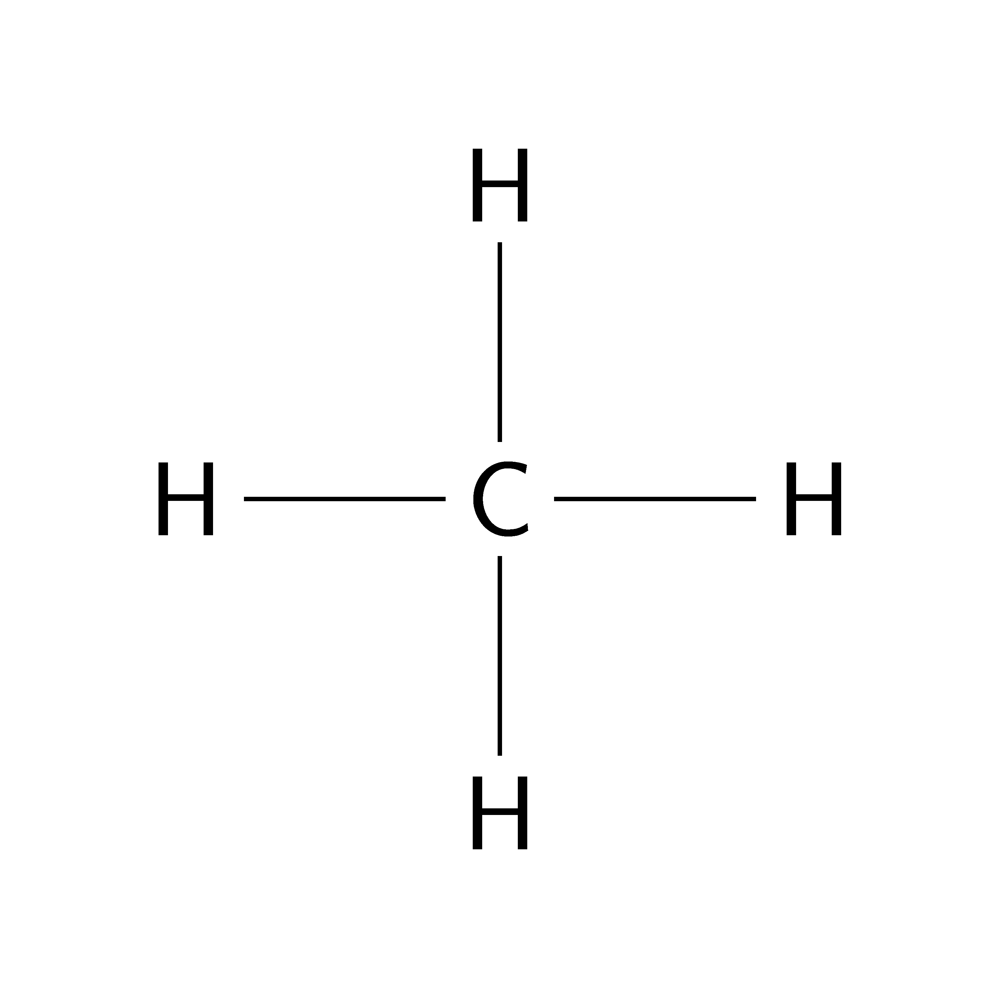
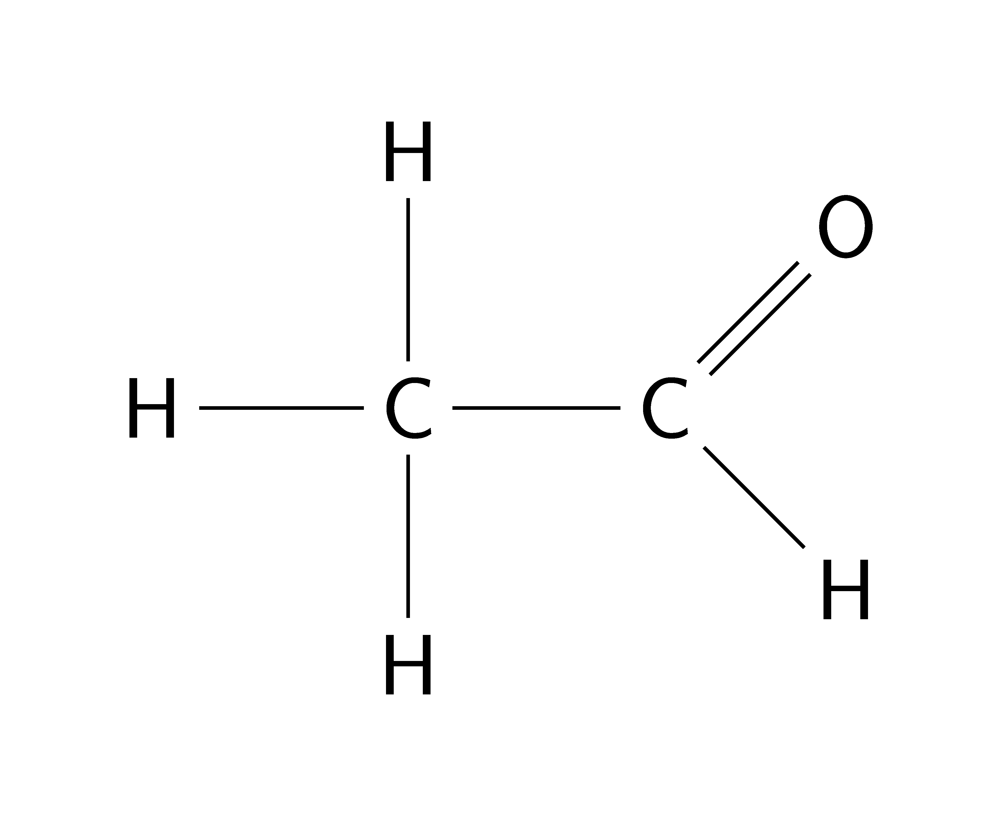
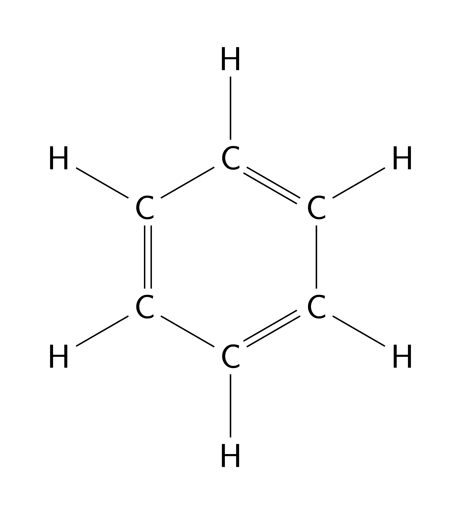

====================================================
Chemistry chemfig LaTeX
====================================================

See: https://www.overleaf.com/learn/latex/Chemistry_formulae
See: https://mirror.aarnet.edu.au/pub/CTAN/macros/generic/chemfig/chemfig-en.pdf

----

chemfig
---------------

| The chemfig package makes it easy to draw structural diagrams of chemicals.

.. literalinclude:: files/methane.tex
   :linenos:

.. figure:: files/ethanol.png
   :width: 300
   :alt: ethanol
   :figclass: align-center

.. literalinclude:: files/ethanol.tex
   :linenos:

.. literalinclude:: files/acetaldehyde.tex
   :linenos:

.. literalinclude:: files/benzene.tex
   :linenos:

.. figure:: files/pentane.png
   :width: 300
   :alt: pentane
   :figclass: align-center

.. literalinclude:: files/pentane.tex
   :linenos:

