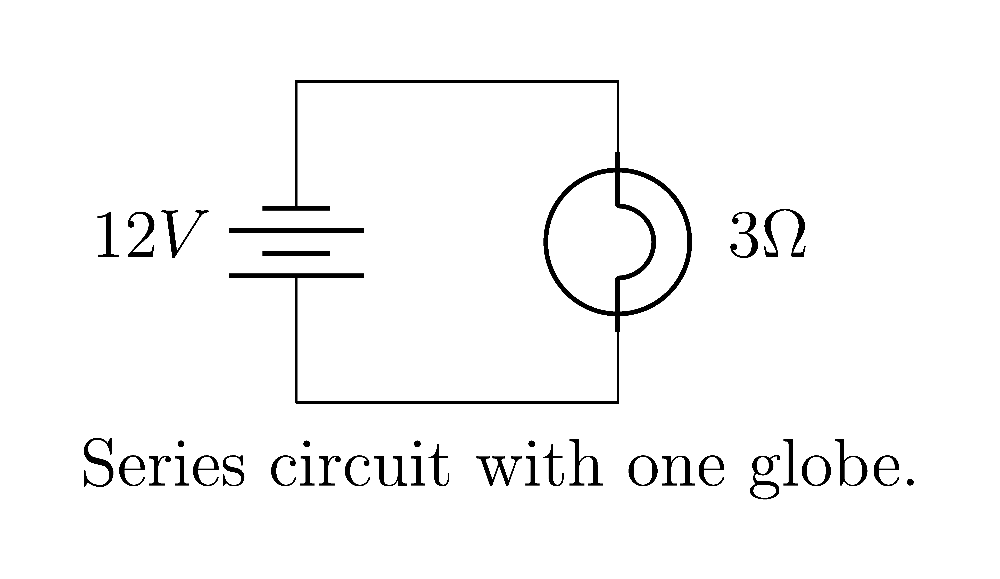

====================================================
Circuits LaTeX
====================================================

| See https://www.youtube.com/watch?v=WRTELZP1l0Y

| A simple circuit is shown below.

.. literalinclude:: files/circuit.tex
   :linenos:

| The `circuitikz` package is used to create circuit diagrams in LaTeX.
| It provides a set of macros and commands to draw circuit elements such as batteries, resistors, and capacitors.
| The `\draw` command is used to draw the circuit elements.
| The `to` keyword is used to connect the elements.
| The options within square brackets specify the type of element and its properties.
In the code you provided, the `to` keyword is used four times to connect circuit elements.
| The first `to` connects the bottom of the battery to the top `(0,0) to[battery={$12V$}] (0,2)`.
| The second `to` connects the top of the battery to a point `(2,2)` using a short wire `to[short] (2,2)`.
| The third `to` connects this point to a bulb with a resistance of 3 Ohms `to[bulb, l=$3\Omega$] (2,0)`.
| The fourth `to` connects the bottom of the bulb back to the bottom of the battery using a short wire `to[short] (0,0)`.

