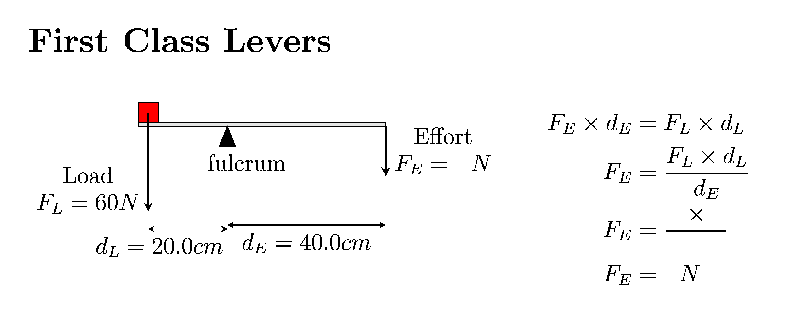
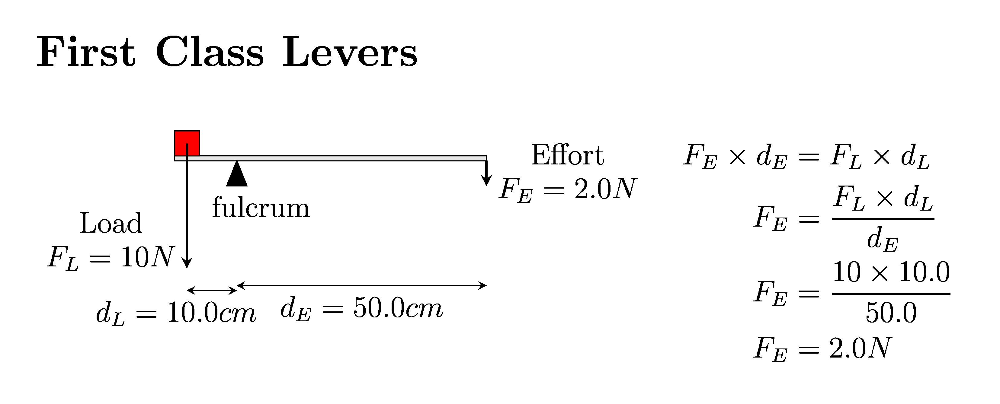

====================================================
Levers tikz
====================================================

| Diagrams of levers can be built using tikz.

----

First Class levers mechanical advantage
----------------------------------------

| A First Class lever diagram is shown below.

.. figure:: files/levers.png
   :width: 600
   :alt: levers.png
   :figclass: align-center

| The LaTeX:

.. literalinclude:: files/levers.tex
   :linenos:

----

 
First Class levers Fd=Fd
-------------------------

| A **question** diagram of a First Class lever is shown below with an **incomplete** force distance calculation.

| The LaTeX:

.. literalinclude:: levers_diagrams/lever_fcl1_q.tex
   :linenos:

| An **answer** diagram of a First Class lever is shown below with a **completed** force distance calculation.

| The LaTeX:

.. literalinclude:: levers_diagrams/lever_fcl1_ans.tex
   :linenos:
     
----
 
Booklet: First Class levers Fd=Fd
---------------------------------------

| A booklet of random first class levers can be created.

:download:`Questions  pdf<levers_booklets/lever_Bk_fcl1_q.pdf>`
:download:`Questions tex<levers_booklets/lever_Bk_fcl1_q.tex>`

:download:`Answers pdf<levers_booklets/lever_Bk_fcl1_ans.pdf>`
:download:`Answerstex<levers_booklets/lever_Bk_fcl1_ans.tex>`

----

Maker files
-------------

The python below requires the following .tex files:

| :download:`lever_booklet_template<levers_makers/lever_booklet_template.tex>`
| :download:`lever_booklet_ans_template<levers_makers/lever_booklet_ans_template.tex>`
| :download:`lever_booklet_diagram_template<levers_makers/lever_booklet_diagram_template.tex>`

| The 2 custom python modules required are:
| :download:`lever_functions.py<levers_makers/lever_functions.py>`
| :download:`magick_pdf_to_png.py<levers_makers/magick_pdf_to_png.py>`

| The Python code that creates a booklet of 5 lever diagrams and calculations per page is:
| :download:`lever_booklet_diagram_maker.py<levers_makers/lever_booklet_diagram_maker.py>`

| The python file, **lever_booklet_diagram_maker.py**, when run, will ask for these inputs:

- Choose the lever class: ``"Enter 1, 2, 3 or 4 for 1st, 2nd, 3rd class levers or random "``.
- Choose the numnber of questions: ``"- Choose the numnber of questions: "``
- Choose the file name base: ``"Enter the base filename to be added to the prefix lever_Bk_:"``. 
- The filename will have "_q" added for the question booklet and "_ans" for the answer booklet.

.. literalinclude:: levers_makers/lever_booklet_diagram_maker.py
   :linenos:

