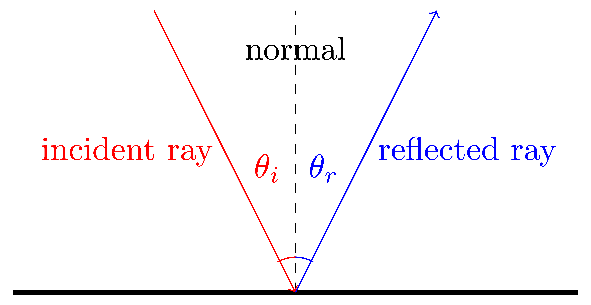
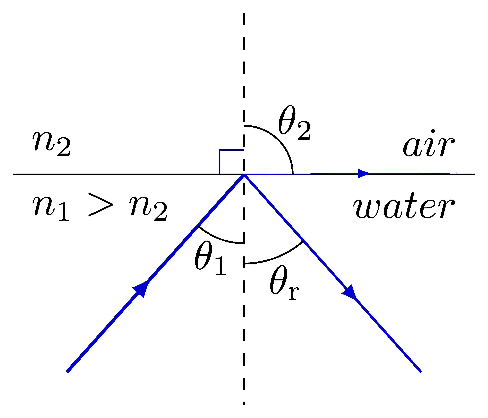
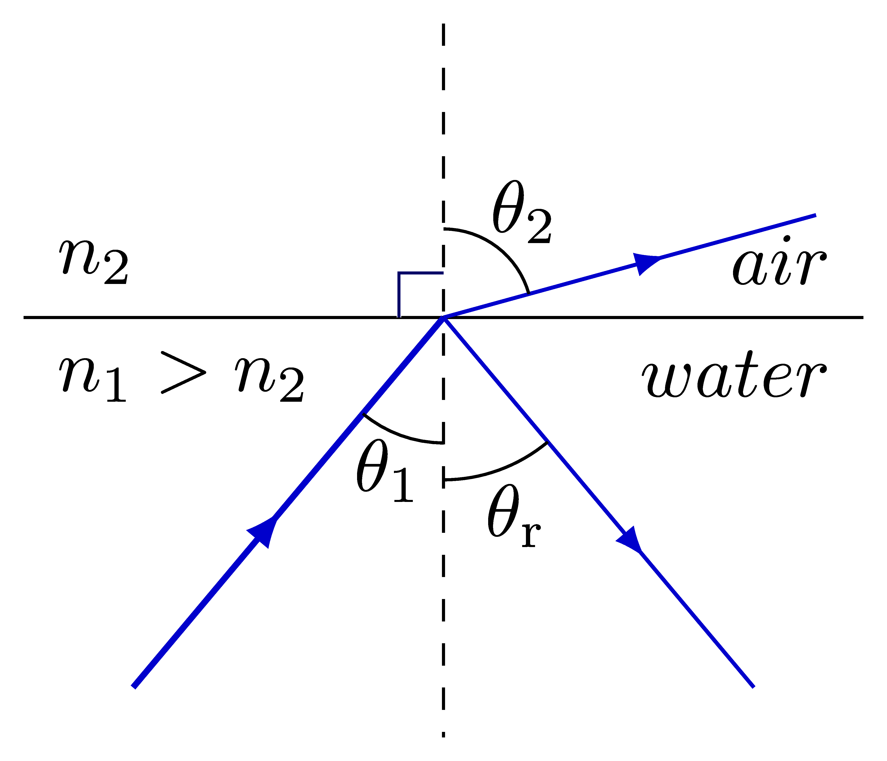

====================================================
Optics tikz
====================================================

Reflection
-------------------

| Reflection of light is shown below.

.. literalinclude:: files/reflection.tex
   :linenos:

----

Total internal Reflection
---------------------------------

| Total internal Reflection of light is shown below.

.. literalinclude:: files/total_internal_reflection.tex
   :linenos:

----

Refraction
---------------------------------

| Refraction of light is shown below.

.. figure:: files/refraction.png
   :width: 300
   :alt: refraction.png
   :figclass: align-center

.. literalinclude:: files/refraction.tex
   :linenos:

.. literalinclude:: files/refraction2.tex
   :linenos:

